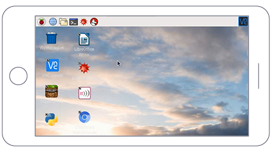

# VNC (Virtual Network Computing)

Sometimes it is not convenient to work directly on the Raspberry Pi. Maybe you would like to work on it from another device by remote control.

VNC is a graphical desktop sharing system that allows you to remotely control the desktop interface of one computer (running VNC Server) from another computer or mobile device (running VNC Viewer). VNC Viewer transmits the keyboard and either mouse or touch events to VNC Server, and receives updates to the screen in return.

You will see the desktop of the Raspberry Pi inside a window on your computer or mobile device. You'll be able to control it as though you were working on the Raspberry Pi itself.



VNC Connect from RealVNC is included with Raspberry Pi OS. It consists of both VNC Server, which allows you to control your Raspberry Pi remotely, and VNC Viewer, which allows you to control desktop computers remotely from your Raspberry Pi should you want to.

You must enable VNC Server before you can use it: instructions for this are given below. By default, VNC Server gives you remote access to the graphical desktop that is running on your Raspberry Pi, as though you were sitting in front of it.

However, you can also use VNC Server to gain graphical remote access to your Raspberry Pi if it is headless or not running a graphical desktop. For more information on this, see **Creating a virtual desktop**, further below. 

## Installing VNC

VNC is already installed on the full Raspberry Pi OS image, and can be installed via `Recommended Software` from the `Preferences` menu on other versions.

If you are not using a desktop you can install it from the command line as follows:

```bash
sudo apt update
sudo apt install realvnc-vnc-server realvnc-vnc-viewer
```

## Enabling VNC Server

You can do this graphically or at the command line.

### Enabling VNC Server graphically

- On your Raspberry Pi, boot into the graphical desktop.

- Select **Menu > Preferences > Raspberry Pi Configuration > Interfaces**. 

- Ensure **VNC** is **Enabled**. 

### Enabling VNC Server at the command line

You can enable VNC Server at the command line using [raspi-config](../../configuration/raspi-config.md):

```bash
sudo raspi-config
```

Now, enable VNC Server by doing the following:

- Navigate to **Interfacing Options**.

- Scroll down and select **VNC > Yes**.

## Connecting to your Raspberry Pi with VNC Viewer

There are two ways to connect to your Raspberry Pi. You can use either or both, depending on what works best for you.

### Establishing a direct connection

Direct connections are quick and simple providing you're joined to the same private local network as your Raspberry Pi. For example, this might be a wired or wireless network at home, at school, or in the office.

- On your Raspberry Pi (using a terminal window or via SSH) use [these instructions](../ip-address.md) or run `ifconfig` to discover your private IP address. 

- On the device you'll use to take control, download VNC Viewer. For best results, use the [compatible app](https://www.realvnc.com/download/viewer/) from RealVNC. 

- Enter your Raspberry Pi's private IP address into VNC Viewer:

  

### Establishing a cloud connection

You are entitled to use RealVNC's cloud service for free, provided that remote access is for educational or non-commercial purposes only.

Cloud connections are convenient and encrypted end-to-end. They are highly recommended for connecting to your Raspberry Pi over the internet. There's no firewall or router reconfiguration, and you don't need to know the IP address of your Raspberry Pi, or provide a static one.

- Sign up for a RealVNC account [here](https://www.realvnc.com/raspberrypi/#sign-up): it's free and it only takes a few seconds.

- On your Raspberry Pi, sign in to VNC Server using your new RealVNC account credentials:

  

- On the device you'll use to take control, download VNC Viewer. You **must** use the [compatible app](https://www.realvnc.com/download/viewer/) from RealVNC.

- Sign in to VNC Viewer using the same RealVNC account credentials, and then either tap or click to connect to your Raspberry Pi:

  

### Authenticating to VNC Server

To complete either a direct or cloud connection, you must authenticate to VNC Server. 

If you're connecting from the [compatible VNC Viewer app](https://www.realvnc.com/download/viewer/) from RealVNC, enter the user name and password you normally use to log in to your user account on the Raspberry Pi. By default, these credentials are `pi` and `raspberry`.

If you're connecting from a non-RealVNC Viewer app, you'll first need to downgrade VNC Server's authentication scheme, specify a password unique to VNC Server, and then enter that instead.
* If you are in front of your Raspberry Pi and can see its screen, open the VNC Server dialog on your Raspberry Pi, select **Menu > Options > Security**, and choose **VNC password** from the **Authentication** dropdown.
* **Or** if you're configuring your Raspberry Pi remotely from the command line, then to make the changes for Service Mode (the default configuration for the Raspberry Pi):
  * Open the `/root/.vnc/config.d/vncserver-x11` config file.
  * Replace `Authentication=SystemAuth` with `Authentication=VncAuth` and save the file.
  * In the command line, run `sudo vncpasswd -service`. This  will prompt you to set a password, and will insert it for you in the right config file for VNC Server running in Service Mode.
  * Restart VNC Server.

## Playing Minecraft and other directly rendered apps remotely

You can remotely access apps which use a directly rendered overlay, such as Minecraft, the text console, the Raspberry Pi Camera Module, and more.


To turn this feature on:

- On your Raspberry Pi, open the VNC Server dialog. 

- Navigate to **Menu > Options > Troubleshooting** and select **Enable experimental direct capture mode**.

- On the device you'll use to take control, run VNC Viewer and connect.

  **Note:** existing connections must be restarted in order for these changes to take effect.

Please note that direct screen capture is an experimental feature. If you're connecting from a desktop computer and mouse movements seem erratic, try pressing **F8** to open the VNC Viewer shortcut menu and selecting **Relative Pointer Motion**.

If performance seems impaired, try [these troubleshooting steps](https://www.realvnc.com/docs/raspberry-pi.html#raspberry-pi-minecraft-troubleshoot), or [let RealVNC know](https://support.realvnc.com/index.php?/Tickets/Submit).

## Creating a virtual desktop

If your Raspberry Pi is headless (i.e. not plugged into a monitor) or controlling a robot, it is unlikely to be running a graphical desktop.

VNC Server can create a **virtual desktop** for you, giving you graphical remote access on demand. This virtual desktop exists only in your Raspberry Pi's memory:


To create and connect to a virtual desktop: 

- On your Raspberry Pi (using Terminal or via SSH), run `vncserver`. Make note of the IP address/display number that VNC Server will print to your Terminal (e.g. `192.167.5.149:1`).

- On the device you'll use to take control, enter this information into [VNC Viewer](https://www.realvnc.com/download/viewer/).

To destroy a virtual desktop, run the following command: 

```bash
vncserver -kill :<display-number>
```

This will also stop any existing connections to this virtual desktop.
