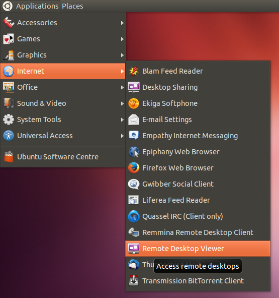

# Connecting to a Pi over VNC using Linux

It is likely that your Linux distribution ships with a `Remote Desktop Viewer` application you can use to connect to your Pi using VNC. This can usually be found under the Applications / Internet menu (see the Ubuntu example below).

Once you have the Remote Desktop Viewer open click the connect button and you'll be see the following dialog. Set the Protocol option to `VNC` and enter the IP address of the Raspberry Pi followed by the screen number (`:0` or `:1`). For example: `192.168.0.6:1`

Click the Connect button and you will be prompted for the password that was specified when configuring the VNC server on the Raspberry Pi earlier. You should then find yourself at the Raspberry Pi desktop.

Don't use the logout menu as you would on the Raspberry Pi desktop when you want to close down. Just close the Remote Desktop Viewer window itself and then use the kill command on the Raspberry Pi, described above, to shut down the VNC server.

An alternative program is `Remmina Remote Desktop Client`, available from [remmina.sourceforge.net](http://remmina.sourceforge.net)
