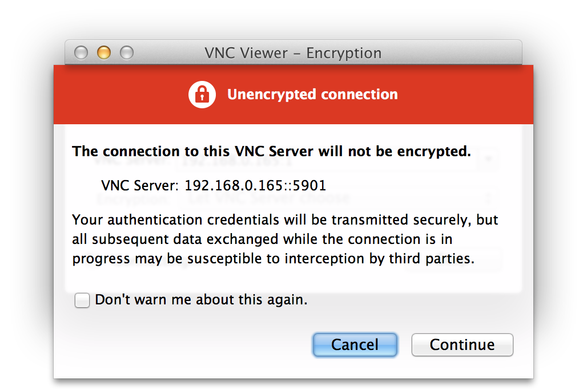

## Connecting to a Pi over VNC using Mac OS

For Mac OS you'll need to install a VNC viewer program. You can use Screen Sharing (which comes installed as standard) but this takes a bit more configuration to get working. There is a program called RealVNC which is known to work with the Raspberry Pi VNC server, it can be downloaded from [realvnc.com](http://www.realvnc.com/download/vnc/latest)

Download the package file and open it. During the setup you'll be offered a choice of the type of installation. You only need the VNC viewer on your Mac and not the server so select custom and then *uncheck* VNC Server (see below).

Click `Continue` and go ahead with the rest of the installation. Once the installation is complete open the finder, then select Applications on the left and enter vnc into the search box. VNC Viewer should then be shown. Perhaps create a shortcut to it in your Dock for future use.

When you run it you'll be presented with the dialog above. You will need to enter the IP address of the Raspberry Pi followed by the screen number (:0 or :1). For example: 192.168.0.165:1

Click the Connect button and you'll be given an unencrypted connection warning.

Generally speaking this warning only needs consideration if the connection between your Mac and the Pi is going over the Internet. If you're using a Local Area Network or a School network then you don't really need to worry. Click *Continue* and you'll be prompted for the password that was specified when configuring the VNC server on the Raspberry Pi earlier. You should then find yourself at the Raspberry Pi desktop.

Don't use the *logout* menu as you would on the Raspberry Pi desktop when you want to close down. Just close the RealVNC window itself and then use the kill command on the Raspberry Pi, described above, to shut down the VNC server.

For further documentation on RealVNC please visit this page: http://www.realvnc.com/products/vnc/documentation/latest/
