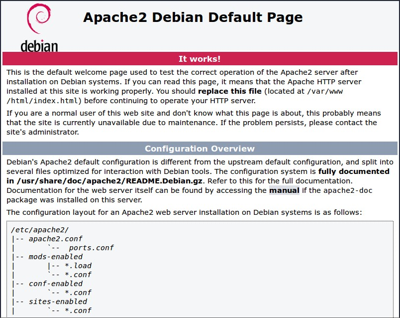

# Setting up an Apache Web Server on a Raspberry Pi

Apache is a popular web server application you can install on the Raspberry Pi to allow it to serve web pages.

On its own, Apache can serve HTML files over HTTP, and with additional modules can serve dynamic web pages using scripting languages such as PHP.

## Install Apache

First, update the available packages by typing the following command into the Terminal:

```bash
sudo apt update
```

Then, install the `apache2` package with this command:

```bash
sudo apt install apache2 -y
```

## Test the web server

By default, Apache puts a test HTML file in the web folder. This default web page is served when you browse to `http://localhost/` on the Pi itself, or `http://192.168.1.10` (whatever the Pi's IP address is) from another computer on the network. To find the Pi's IP address, type `hostname -I` at the command line (or read more about finding your [IP address](../ip-address.md)).

Browse to the default web page either on the Pi or from another computer on the network and you should see the following:



This means you have Apache working!

### Changing the default web page

This default web page is just an HTML file on the filesystem. It is located at `/var/www/html/index.html`.

Navigate to this directory in a terminal window and have a look at what's inside:

```
cd /var/www/html
ls -al
```

This will show you:

```bash
total 12
drwxr-xr-x  2 root root 4096 Jan  8 01:29 .
drwxr-xr-x 12 root root 4096 Jan  8 01:28 ..
-rw-r--r--  1 root root  177 Jan  8 01:29 index.html
```

This shows that by default there is one file in `/var/www/html/` called `index.html`and it is owned by the `root` user (as is the enclosing folder). In order to edit the file, you need to change its ownership to your own username. Change the owner of the file (the default `pi` user is assumed here) using `sudo chown pi: index.html`.

You can now try editing this file and then refreshing the browser to see the web page change.

### Your own website

If you know HTML you can put your own HTML files and other assets in this directory and serve them as a website on your local network.

## Additional - install PHP

To allow your Apache server to process PHP files, you'll need to install the latest version of PHP and the PHP module for Apache. Type the following command to install these:

```bash
sudo apt install php libapache2-mod-php -y
```

Now remove the `index.html` file:

```bash
sudo rm index.html
```

and create the file `index.php`:

```bash
sudo nano index.php
```

Put some PHP content in it:

```php
<?php echo "hello world"; ?>
```

Now save and refresh your browser. You should see "hello world". This is not dynamic but still served by PHP. Try something dynamic:

```php
<?php echo date('Y-m-d H:i:s'); ?>
```

or show your PHP info:

```php
<?php phpinfo(); ?>
```

### Further - WordPress

Now you have Apache and PHP installed you can progress to setting up a WordPress site on your Pi. Continue to [WordPress usage](../../usage/wordpress/README.md).
