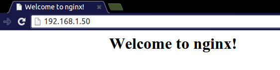

# Setting up an NGINX web server on a Raspberry Pi

NGINX (pronounced *engine x*) is a popular lightweight web server application you can install on the Raspberry Pi to allow it to serve web pages.

Like Apache, NGINX can serve HTML files over HTTP, and with additional modules can serve dynamic web pages using scripting languages such as PHP.

## Install NGINX

First install the `nginx` package by typing the following command in to the Terminal:

```bash
sudo apt-get install nginx
```

and start the server with:

```bash
sudo /etc/init.d/nginx start
```

## Test the web server

By default, NGINX puts a test HTML file in the web folder. This default web page is served when you browse to `http://localhost/` on the Pi itself, or `http://192.168.1.10` (whatever the Pi's IP address is) from another computer on the network. To find the Pi's IP address, type `hostname -I` at the command line (or read more about finding your [IP address](../../troubleshooting/hardware/networking/ip-address.md)).

Browse to the default web page either on the Pi or from another computer on the network and you should see the following:



### Changing the default web page

NGINX defaults its web page location to `/usr/share/nginx/www` on Raspbian. Navigate to this folder and edit or replace index.html as you like.


## Additional - Install PHP

```bash
sudo apt-get install php5-fpm
```

### Enable PHP in NGINX

```bash
cd /etc/nginx
sudo nano sites-enabled/default 
```

find the line 
```
index index.html index.htm;
```

roughly around line 25 (Press `CTRL + C` in nano to see the current line number)

Add `index.php` after `index` to look like this:

```
index index.php index.html index.htm;
```

Scroll down until you find a section with the following content:

```
	# pass the PHP scripts to FastCGI server listening on 127.0.0.1:9000
	#
	# location ~ \.php$ {
```

Edit by removing the `#` characters on the following lines:

```
location ~ \.php$ {
	fastcgi_split_path_info ^(.+\.php)(/.+)$;
	fastcgi_pass unix:/var/run/php5-fpm.sock;
	fastcgi_index index.php;
	include fastcgi.conf;
}

```

It should look like this:

```
        # pass the PHP scripts to FastCGI server listening on 127.0.0.1:9000
        #
        location ~ \.php$ {
                fastcgi_split_path_info ^(.+\.php)(/.+)$;
        #       # NOTE: You should have "cgi.fix_pathinfo = 0;" in php.ini
        #
        #       # With php5-cgi alone:
        #       fastcgi_pass 127.0.0.1:9000;
                # With php5-fpm:
                fastcgi_pass unix:/var/run/php5-fpm.sock;
                fastcgi_index index.php;
                include fastcgi.conf;
        }
```

Reload the configuration file

```bash
sudo /etc/init.d/nginx reload
```

### Test PHP

Rename `index.html` to `index.php`:

```bash
cd /usr/share/nginx/www/
sudo mv index.html index.php
```

Open `index.php` for with a text editor:

```bash
sudo nano index.php
```

Add some dynamic PHP content by replacing the current content:
```php
<?php echo phpinfo(); ?>
``` 

Save and refresh your browser. You should see a page with the PHP version, logo and current configuration settings.
