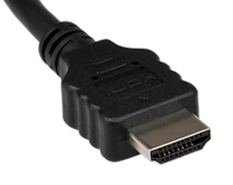
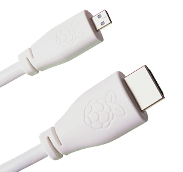
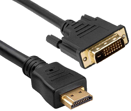
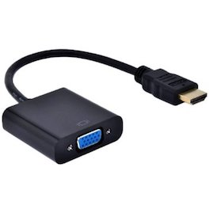
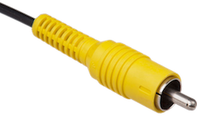

# Monitor connection

For regular use, you'll want to plug the Raspberry Pi in to a visual display: a monitor or a TV.

## HDMI port

The Raspberry Pi has an HDMI port which you can connect directly to a monitor or TV with an HDMI cable. This is the easiest solution; some modern monitors and TVs have HDMI ports, some do not, but there are other options.

Note that the Raspberry Pi 4 has two micro HDMI connectors, which require a good-quality micro HDMI cable, especially when using 4K monitors/TVs. Raspberry Pi sell a suitable cable; for more details see [here](https://www.raspberrypi.org/products/micro-hdmi-to-standard-hdmi-a-cable/).

### DVI

For monitors with a DVI port, you can use an HDMI-to-DVI cable, or an HDMI cable with a DVI adapter. Note that the DVI standard does not support audio.

   

### VGA

For monitors with VGA only, you can use an HDMI-to-VGA adapter. Note that VGA does not support audio.

   

## Composite Port

All models of Raspberry Pi have a composite out port for connecting to analog devices, but the type of connector varies depending on the model. The original Raspberry Pi used an RCA connector, and a standard RCA composite video lead will work. Others models (Raspberry Pi B+ and later) combine the audio out and composite out on to the same 3.5mm jackplug. This requires a particular type of lead, with audio left on the tip, audio right on ring 1, ground on ring 2, and video on the sleeve. This is the same as leads used on the Zune, and on Apple devices.

   

More information on connecting to a monitor can be found in our [learning resources section](https://www.raspberrypi.org/learning/hardware-guide/equipment/).
