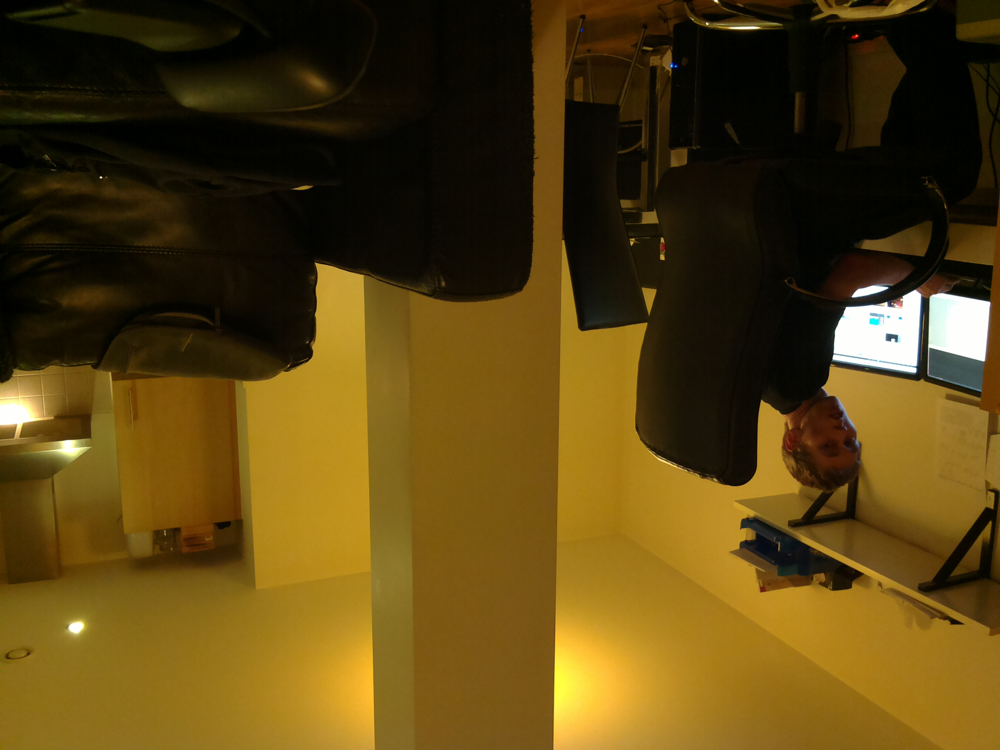
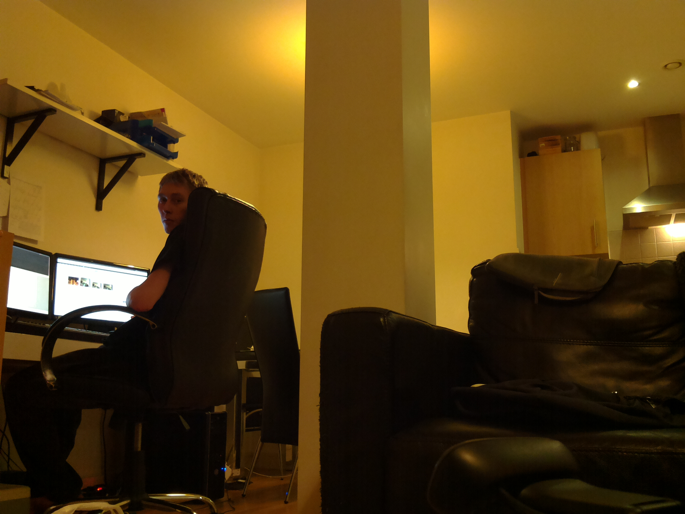

# raspistill

`raspistill` is the command line tool for capturing still photographs with a Raspberry Pi camera module.

## Basic usage of raspistill

With a camera module [connected and enabled](../README.md), enter the following command in the terminal to take a picture:

```bash
raspistill -o cam.jpg
```



In this example the camera has been positioned upside-down. If the camera is placed in this position, the image must be flipped to appear the right way up.

### Vertical flip and horizontal flip

With the camera placed upside-down, the image must be rotated 180° to be displayed correctly. The way to correct for this is to apply both a vertical and a horizontal flip by passing in the `-vf` and `-hf` flags:

```bash
raspistill -vf -hf -o cam2.jpg
```



Now the photo has been captured correctly.

### Resolution

The camera module takes pictures at a resolution of `2592 x 1944` which is 5,038,848 pixels or 5 megapixels.

### File size

A photo taken with the camera module will be around 2.4MB. This is about 425 photos per GB.

Taking 1 photo per minute would take up 1GB in about 7 hours. This is a rate of about 144MB per hour or 3.3GB per day.

### Bash script

You can create a Bash script which takes a picture with the camera. To create a script, open up your editor of choice and write the following example code:

```bash
#!/bin/bash

DATE=$(date +"%Y-%m-%d_%H%M")

raspistill -vf -hf -o /home/pi/camera/$DATE.jpg
```

This script will take a picture and name the file with a timestamp.

You'll also need to make sure the path exists by creating the `camera` folder:

```bash
mkdir camera
```

Say we saved it as `camera.sh`, we would first make the file executable:

```bash
chmod +x camera.sh
```

Then run with:

```bash
./camera.sh
```

### More options

For a full list of possible options, run `raspistill` with no arguments. To scroll, redirect stderr to stdout and pipe the output to `less`:

```bash
raspistill 2>&1 | less
```

Use the arrow keys to scroll and type `q` to exit.

## Full documentation

Full documentation of the camera can be found at [hardware/camera](../../../hardware/camera/README.md).
