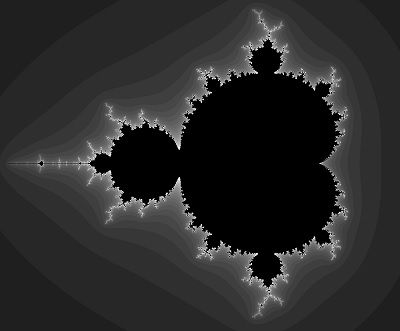

# THIS PAGE IS NOW DEPRECATED

# Hello Fractal

This one displays two superimposed fractals, one on top of the other. You can move the mouse to change the shape of the fractal in real time. This is also intended to demonstrate OpenGL ES rendering. Some of you may recognise that this is the [Mandelbrot fractal](https://en.wikipedia.org/wiki/Mandelbrot_set).



```bash
cd ..
cd hello_triangle2
ls
```

Notice the green `.bin` file? OK, run it!

```bash
./hello_triangle2.bin
```

Now move the mouse around, and you’ll see the fractal changing. See if you can get it to form a perfect circle; it’s a little tricky, but it can be done. To exit the demo press `Ctrl + C`.

