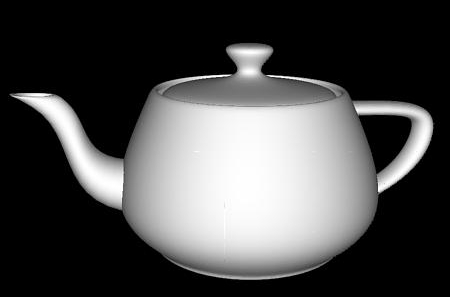

# THIS PAGE IS NOW DEPRECATED

# Hello Teapot

This displays a spinning teapot with the video clip from `hello_video` texture-mapped onto its surface. It's pretty impressive! You may recognise the teapot model if you’re familiar with a piece of software called [Blender](https://en.wikipedia.org/wiki/Blender_(software)). This demonstrates OpenGL ES rendering and video decoding/playback at the same time.



```bash
cd ..
cd hello_teapot
ls
```

Notice the green `.bin` file? OK, run it!

```bash
./hello_teapot.bin
```

You may receive the following error when you try to run this demo:  

```bash
Note: ensure you have sufficient gpu_mem configured
eglCreateImageKHR:  failed to create image for buffer 0x1 target 12465 error 0x300c
eglCreateImageKHR failed.
```

Don’t worry though; if you see this error, you just need to alter one configuration setting to make it work.  

The error means the GPU (graphics processing unit) does not have enough memory to run the demo. It’s the GPU that does all the heavy lifting when drawing 3D graphics to the screen, a bit like the graphics card in a gaming PC. The Raspberry Pi shares its memory/RAM between the CPU and GPU, and by default is configured to only give 64 MB of RAM to the GPU. If we increase this to 128 MB that should fix the problem.

To do that, you'll need to enter the following command:

```bash
sudo raspi-config
```

This will open up a menu on a blue background. Perform the following actions:

- Go to Advanced Options.
- Go to Memory Split.
- Delete `64` and enter `128` instead. Press `enter`.
- Go down to Finish.
- Click Yes to reboot.

After you have logged back in, enter the following command to get back to the `hello_teapot` demo:

```bash
cd /opt/vc/src/hello_pi/hello_teapot
```

Now try and run it again, and you should find it will work.

```bash
./hello_teapot.bin
```

The demo will run forever until you quit. To exit the demo press `Ctrl + C`. 
