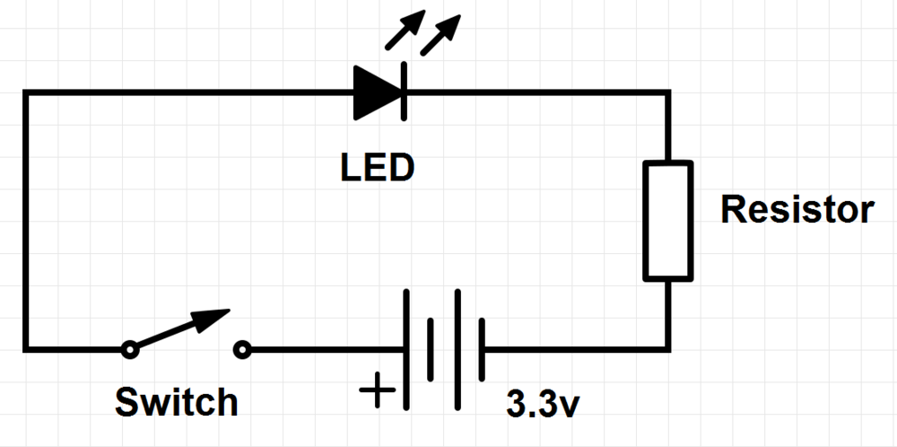
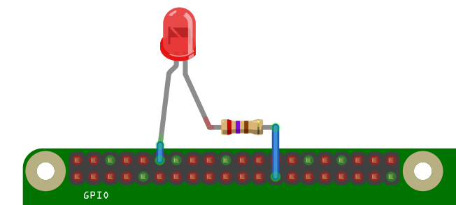
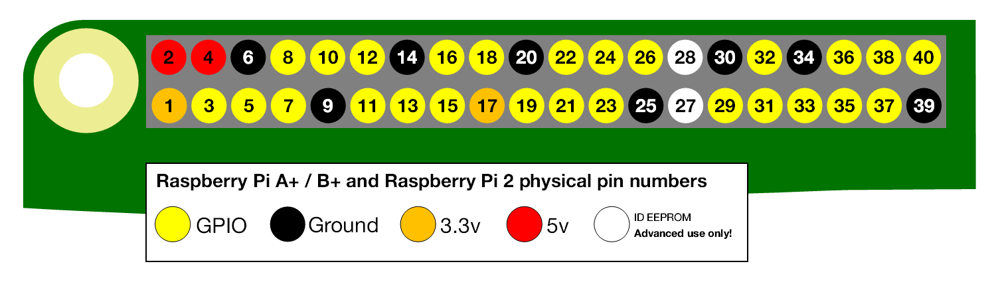

# GPIO: Models A+, B+ and Raspberry Pi 2

### An introduction to GPIO and physical computing on the Raspberry Pi

One powerful feature of the Raspberry Pi is the row of GPIO (general purpose input/output) pins along the top edge of the board.

These pins are a physical interface between the Pi and the outside world. At the simplest level, you can think of them as switches that you can turn on or off (input) or that the Pi can turn on or off (output). Of the 40 pins, 26 are GPIO pins and the others are power or ground pins (plus two ID EEPROM pins which you should not play with unless you know your stuff!)

Note that the numbering of the GPIO pins is rather weird. *Appendix 1: A note on pin numbering*  below explains why.

## What are they for? What can I do with them?

You can program the pins to interact in amazing ways with the real world. Inputs don't have to come from a physical switch; it could be input from a sensor or a signal from another computer or device, for example. The output can also do anything, from turning on an LED to sending a signal or data to another device. If the Raspberry Pi is on a network, you can control devices that are attached to it from anywhere\*\* and those devices can send data back. Connectivity and control of physical devices over the internet is a powerful and exciting thing, and the Raspberry Pi is ideal for this. There are lots of brilliant examples of physical computing on [our blog](http://www.raspberrypi.org/blog/).

**Note**: Not **literally** anywhere, of course. You need things like access to the network, a network capable computing device, and electricity. Please do not write to us to point this out. :)

## How the GPIO pins work

### Output

**WARNING**: If you follow the instructions, then messing about with the GPIO is safe and fun. Randomly plugging wires and power sources into your Pi, however, may kill it. Bad things can also happen if you try to connect things to your Pi that use a lot of power; LEDs are fine, motors are not. If you are worried about this, then you might want to consider using a breakout board such as the [Pibrella](http://pibrella.com/) until you are confident enough to use the GPIO directly.

Ignoring the Pi for a moment, one of the simplest electrical circuits that you can build is a battery connected to a light source and a switch (the resistor is there to protect the LED):

When we use a GPIO pin as an output, the Raspberry Pi replaces **both the switch and the battery** in the above diagram. Each pin can turn on or off,or go HIGH or LOW in computing terms. When the pin is HIGH it outputs 3.3 volts (3v3); when the pin is LOW it is off.

Here's the same circuit using the Raspberry Pi. The LED is connected to a GPIO pin (which can output +3v3) and a ground pin (which is 0v and acts like the negative terminal of the battery):

The next step is to write a program to tell the pin to go HIGH or LOW. Here's an example using [Python](http://www.raspberrypi.org/learning/quick-reaction-game/) (see Step 2), and here's how to do it in [Scratch](http://www.raspberrypi.org/learning/robot-antenna/).

### Input

GPIO **outputs** are easy; they are on or off, HIGH or LOW, 3v3 or 0v. **Inputs** are a bit trickier because of the way that digital devices work. Although it might seem reasonable just to connect a button across an input pin and a ground pin, the Pi can get confused as to whether the button is on or off. It might work properly, it might not. It's a bit like floating about in deep space; without a reference it would be hard to tell if you were going up or down, or even what up or down meant!

This is why you will see phrases like "pull up" and "pull down" in Raspberry Pi GPIO tutorials. It's a way of giving the input pin a reference so it knows for certain when an input is received.

If you'd like to have a go at using the GPIO as an input then have a look at our [screaming jelly baby](http://www.raspberrypi.org/learning/screaming-jellybaby/) and [quick reaction game](http://www.raspberrypi.org/learning/quick-reaction-game/) tutorials for Python, or a [reaction game](http://www.raspberrypi.org/learning/reaction-game/) for Scratch.

## The end of the guide. The start of something amazing

We hope that this has encouraged you to have a go at physical computing using the Pi's GPIO; it's really not as daunting as it looks. It all starts with a simple LED, but it can take you to incredible places. Do not underestimate the fun, creativity and sense of achievement you can get from a little computer and a bunch of pins. Have fun! And if you do make something cool please let us know. :)

---

## Glossary

### GPIO

General purpose input/output; in this specific case the pins on the Raspberry Pi and what you can do with them. So called because you can use them for all sorts of purposes; most can be used as either inputs or outputs, depending on your program.

### LED

Light-emitting diode- a small, low-power light source used widely in electronics. Ideal as an introduction to physical computing on the Pi.

### Physical computing

Computing that involves tangible things connected to a computer, beyond standard input and output devices like keyboards and monitors. Think buttons, lights, robots, alarms, sensors, home automation, teddy bears called Babbage in near space and so on. We love physical computing because as well as being lots of fun, it's such a powerful teaching and learning tool and encourages creativity, problem solving, and collaboration. Computing **beyond the screen** engages children of all ages, and you can make very cool stuff!

---

## Appendix 1. A note on pin numbering

When programming the GPIO pins there are two different ways to refer to them: GPIO numbering and physical numbering. 

#### GPIO numbering

These are the GPIO pins as the computer sees them. The numbers don't make any sense to humans, they jump about all over the place, so there is no easy way to remember them. You will need a printed reference or a reference board that fits over the pins. 

#### Physical numbering

The other way to refer to the pins is by simply counting across and down from pin 1 at the top left (nearest to the SD card). This is 'physical numbering' and it looks like this:

#### Which system should I use?

Beginners and young children may find the physical numbering system simpler -- you simply count the pins. You'll still need a diagram like the one above to know which are GPIO pins, which are ground and which are power though. 

Generally we recommend using the GPIO numbering. It's good practice and most resources use this system. Take your pick though -- as long as you use the same system within a program then all will be well. Note that pin numbering can also depend on what programming language you are using: Scratch GPIO, for example, uses physical pin numbers whereas in Python you can choose which to use.

For more details on the advanced capabilities of the GPIO pins see gadgetoid's [interactive pinout diagram](http://pi.gadgetoid.com/pinout).
