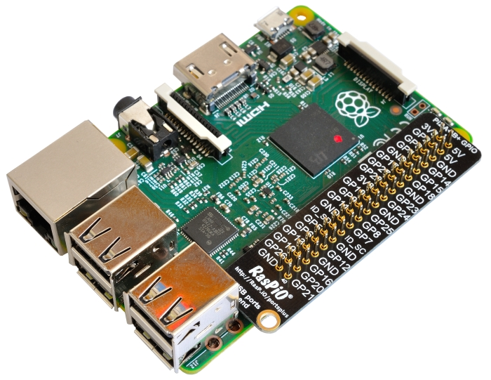

# GPIO

A powerful feature of the Raspberry Pi is the row of GPIO (general-purpose input/output) pins along the top edge of the board. A 40-pin GPIO header is found on all current Raspberry Pi boards (unpopulated on Pi Zero and Pi Zero W). Prior to the Pi 1 Model B+ (2014), boards comprised a shorter 26-pin header.


Any of the GPIO pins can be designated (in software) as an input or output pin and used for a wide range of purposes.


**Note: the numbering of the GPIO pins is not in numerical order; GPIO pins 0 and 1 are present on the board (physical pins 27 and 28) but are reserved for advanced use (see below).**

## Voltages

Two 5V pins and two 3V3 pins are present on the board, as well as a number of ground pins (0V), which are unconfigurable. The remaining pins are all general purpose 3V3 pins, meaning outputs are set to 3V3 and inputs are 3V3-tolerant.

## Outputs

A GPIO pin designated as an output pin can be set to high (3V3) or low (0V).

## Inputs

A GPIO pin designated as an input pin can be read as high (3V3) or low (0V). This is made easier with the use of internal pull-up or pull-down resistors. Pins GPIO2 and GPIO3 have fixed pull-up resistors, but for other pins this can be configured in software.

## More

As well as simple input and output devices, the GPIO pins can be used with a variety of alternative functions, some are available on all pins, others on specific pins.

- PWM (pulse-width modulation)
    - Software PWM available on all pins
    - Hardware PWM available on GPIO12, GPIO13, GPIO18, GPIO19
- SPI
    - SPI0: MOSI (GPIO10); MISO (GPIO9); SCLK (GPIO11); CE0 (GPIO8), CE1 (GPIO7)
    - SPI1: MOSI (GPIO20); MISO (GPIO19); SCLK (GPIO21); CE0 (GPIO18); CE1 (GPIO17); CE2 (GPIO16)
- I2C
    - Data: (GPIO2); Clock (GPIO3)
    - EEPROM Data: (GPIO0); EEPROM Clock (GPIO1)
- Serial
    - TX (GPIO14); RX (GPIO15)

## GPIO pinout

It's important to be aware of which pin is which. Some people use pin labels (like the [RasPiO Portsplus](http://rasp.io/portsplus/) PCB, or the printable [Raspberry Leaf](https://github.com/splitbrain/rpibplusleaf)).



A handy reference can be accessed on the Raspberry Pi by opening a terminal window and running the command `pinout`. This tool is provided by the [GPIO Zero](https://gpiozero.readthedocs.io/) Python library, which is installed by default on the Raspberry Pi OS desktop image, but not on Raspberry Pi OS Lite.


For more details on the advanced capabilities of the GPIO pins see gadgetoid's [interactive pinout diagram](http://pinout.xyz/).

## Programming with GPIO

It is possible to control GPIO pins using a number of programming languages and tools. See the following guides to get started:

- [GPIO with Scratch 1.4](scratch1/README.md)
- [GPIO with Scratch 2](scratch2/README.md)
- [GPIO with Python](python/README.md)
- [GPIO with C/C++ using standard kernel interface via libgpiod](https://kernel.googlesource.com/pub/scm/libs/libgpiod/libgpiod/+/v0.2.x/README.md)
- [GPIO with C/C++ using 3rd party library pigpio](http://abyz.me.uk/rpi/pigpio/)
- [GPIO with Processing3](https://processing.org/reference/libraries/io/GPIO.html)

**Warning: while connecting up simple components to the GPIO pins is perfectly safe, it's important to be careful how you wire things up. LEDs should have resistors to limit the current passing through them. Do not use 5V for 3V3 components. Do not connect motors directly to the GPIO pins, instead use an [H-bridge circuit or a motor controller board](https://projects.raspberrypi.org/en/projects/physical-computing/16).**

## Permissions

In order to use the GPIO ports your user must be a member of the `gpio` group. The `pi` user is a member by default, other users need to be added manually.

```bash
sudo usermod -a -G gpio <username>
```
