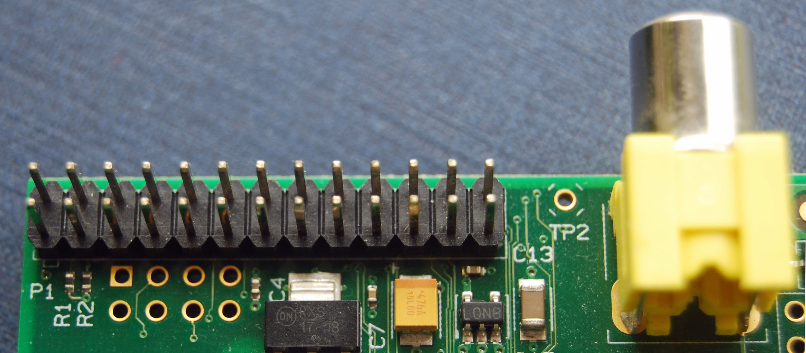
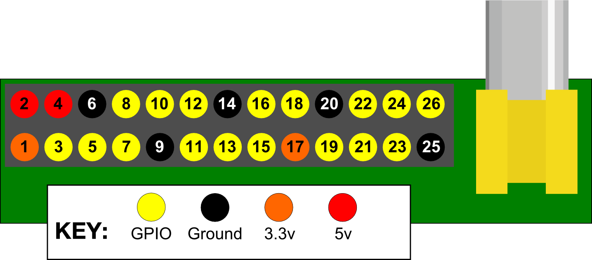

#Connecting your Raspberry Pi to the real world
###An introduction to GPIO and physical computing on the Raspberry Pi
One powerful feature of the Raspberry Pi is the row of GPIO (general purpose input/output) pins along the edge of the board, next to the yellow video out socket.

 These pins are a physical interface between the Pi and the outside world. At the simplest level you can think of them as switches that you can turn on or off (input) or that the Pi can turn on or off (output). Seventeen of the 26 pins are GPIO pins; the others are power or ground pins.

##What are they for? What can I do with them
You can program the pins to do stuff and interact in amazing ways with the real world. Inputs don't have to come from a physical switch: for example, it could be input from a sensor or a signal from another computer or device. And the output can do anything from turning on an LED to sending a signal or data to another device. If the Raspberry Pi is on a network you can control devices that are attached to it from anywhere\*\* and those devices can send data back. Connectivity and control of physical devices over the internet is a powerful and exciting thing and the Raspberry Pi is ideal for this. There are lots of brilliant examples of physical computing on [our blog][].
> 
> \*\*Note: not *literally* anywhere of course. You need things like access to the network and a network capable computing device. And electricity and stuff. Please do not write to us to point this out :)

[our blog]: http://www.raspberrypi.org/blog "Raspberry Pi blog"

##How the GPIO pins work
###Output
> **WARNING**: If you follow the instructions then messing about with the GPIO is safe and fun and your Pi will be happy. Randomly plugging wires and power sources into your Pi, however,  may kill it. Bad things can also happen if you try to connect things to your Pi that use a lot of power. LEDs are fine, motors are not. If you are worried about this then you might want to consider using a breakout board such as the [Pibrella][] until you are confident enough to use the GPIO directly. 

[Pibrella]: http://shop.pimoroni.com/collections/raspberry-pi-electronics-kits

Ignoring the Pi for a moment, one of the simplest electrical circuits that you can build is a battery connected to a light source and a switch (the resistor is there to protect the LED):

When we use a GPIO pin as an output, the Raspberry Pi replaces *both the switch and the battery* in the above diagram. Each pin can turn on or off (or go HIGH or LOW in computing terms). When the pin is HIGH it outputs 3.3 volts (3v3). When the pin is LOW it is off.

Here's the same circuit using the Raspberry Pi. The LED is connected to a GPIO pin (which can output +3v3) and a ground pin (which is 0v and acts like the negative terminal of the battery):

The next step is to write a program to tell the pin to go HIGH or LOW. Here's an example using [Python][] (see Step 2) and here's how to do it in [Scratch][] . 

[Scratch]: http://www.raspberrypi.org/learning/robot-antenna/
[Python]: http://www.raspberrypi.org/learning/quick-reaction-game/

###Input

 GPIO *outputs* are dead easy: they are on or off, HIGH or LOW, 3v3 or 0v. No messing about. *Inputs* are a bit trickier because of the way that digital devices work. Although it might seem reasonable just to connect a button across an input pin and a ground pin, the Pi can get confused as to whether the button is on or off. It might work properly, it might not. It's a bit like floating about in deep space: without a reference it would be hard to tell if you were going up or down (or even what up or down meant!).

 This is why you will see phrases like "pull up" and "pull down" in Raspberry Pi GPIO tutorials. It's a way of giving the input pin a reference so it knows for certain when an input is received.

If you'd like to have a go at using the GPIO as an input then have a look at our [screaming jelly baby] and [quick reaction game] tutorials for Python or a [reaction game] for Scratch.

[quick reaction game]: http://www.raspberrypi.org/learning/quick-reaction-game/
[screaming jelly baby]: http://www.raspberrypi.org/learning/screaming-jellybaby/
[reaction game]: http://www.raspberrypi.org/learning/reaction-game/

##The end of the guide. The start of something amazing

We hope that this has encouraged you to have a go at physical computing using the Pi's GPIO--it's really not as daunting as it looks. It all starts with simple LED but can take you to incredible places. Do not underestimate the fun, creativity and sense of achievement you can get from a little computer and a bunch of pins.  Have fun! And if you do make something cool please let us know :)

##Glossary
**BCM mode** GPIO pin numbering system where pins are referred to as they are seen by the SoC (system on chip -- the 'brains' of the Raspberry Pi). The system has its basis in engineering so to most people it appears random. BCM is short for Broadcom, who make the SoC.

**BOARD mode** GPIO pin numbering system where pin 1 is top left (with the SD card slot at the top), and the pins are counted across and down. The pins in the vertical column on the left are odd-numbered, those in the right column even-numbered, with pin 26 bottom right.

**GPIO** General purpose input/output, specifically in this case the pins on the Raspberry Pi and what you can do with them. So called because you can use them for all sorts of things and most can be used as either inputs or outputs, depending on your program.

**LED** Light emitting diode. A small, low power light source used widely in electronics. Ideal as an introduction to physical computing on the Pi.

**Physical computing** Computing that involves tangible things connected to a computer, beyond standard input and output devices like keyboards and monitors. Think buttons, lights, robots, alarms, sensors, home automation, teddy bears called Babbage in near space etc. We love physical computing because as well as being lots of fun it's such a powerful teaching and learning tool and encourages creativity, problem solving and collaboration. Computing 'beyond the screen' engages children of all ages. And you can make very cool stuff.

----------

###A technical note on pin numbering.
 When programming the GPIO pins there are two different ways to refer to them. You can count across and down from pin 1 at the top left (nearest to the SD card) as in the diagram at the top of the page. (You may see this referred to as BOARD mode in Python.) Alternatively you can refer to the pins as the computer sees them (BCM mode). You can see this on the Raspberry Pi LED circuit above: for example, physical pin 3 is labelled '2' and physical pin 11 is labelled '17'.

Whilst there are good reasons for software engineers to use the BCM numbering system (the GPIO pins can do more than just simple input and output), most beginners find the "human readable" numbering system more useful. Counting down the pins is simple and you don't need a reference or have to remember which is which. Take your pick though--as long as you use the same scheme within a program then all will be well. Note that pin numbering can also depend on what programming language you are using, for example Scratch GPIO enforces certain pins as input and output. 

For more details on the advanced capabilities of the GPIO pins see gadgetoid's [interactive pinout][] diagram.

[interactive pinout]: http://pi.gadgetoid.com/pinout
