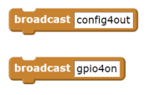
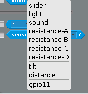
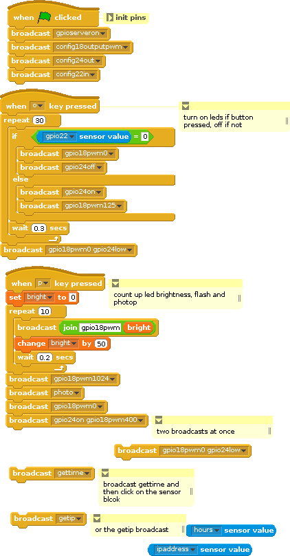
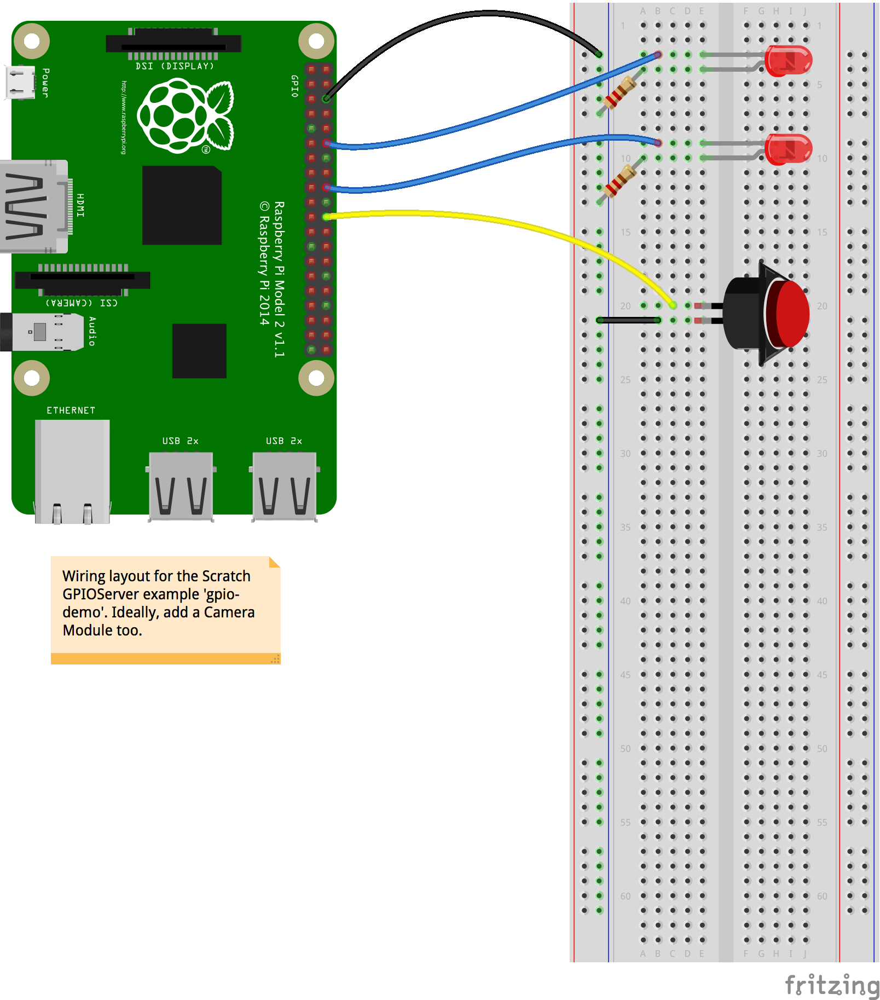
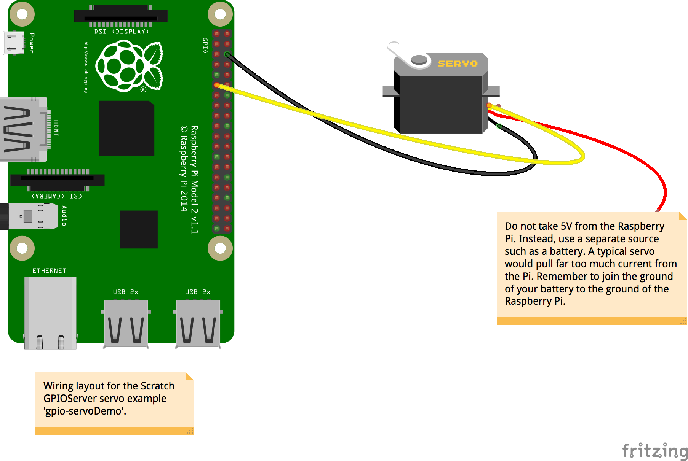
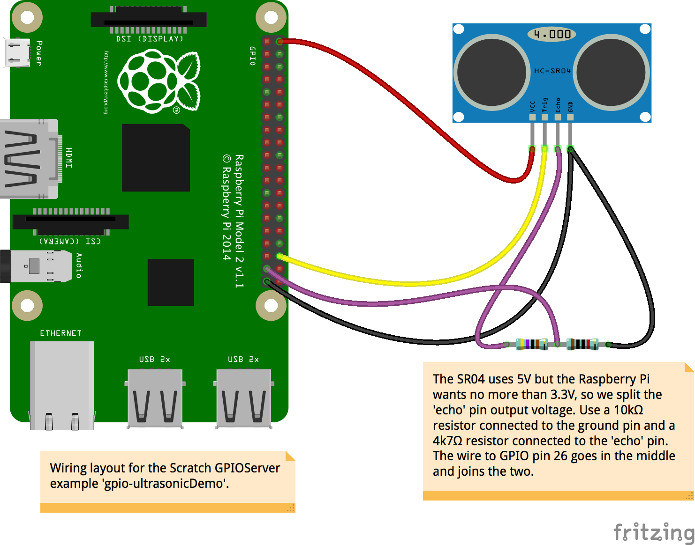

# GPIO in Scratch 1.4

## Usage and basic capabilities

### Starting the server

Before you can use the GPIO pins, you must start the GPIO server. There are several ways to do this:

- Choose **Start GPIO server** from the **Edit** menu to turn it on. If the server is already running, then **Stop GPIO server** will turn it off.
- A Scratch broadcast of `gpioserveron` or `gpioserveroff` will have the same effects.
- Projects saved when the GPIO server is running will have that status recorded and, on loading, will try to start the server if it is enabled.
- You can also set an option in the scratch INI file. See the Appendix below.

### Basic GPIO usage

Without any further setup, you now have access to the basics of the GPIO system. This currently uses the broadcast blocks to send commands to the GPIO server just like the original mesh network-based broadcast messages.

For instance, to configure GPIO pin 4 as an output and turn it on, you create the two following broadcasts:

As always, you can assemble this text with normal join, pick, or list-handling blocks. For example, if `foo` = 17, then

   

would broadcast `gpio17on` and thus set the GPIO pin number 17 (under the BCM numbering - not the physical or wiringPi numbers!) to `on`.

The pins need configuring before you can use them to do anything. We can set the direction of the pin (in or out) and, for input pins, the pull-up mode (up, down, none).

- For input pins we can use 'in' or 'input'. Both of these are treated the same as 'inpullup' or 'inputpullup' and default to setting the pull-up resistor to pull up the signal.
    + To set the pull-up resistor to pull the signal down, we use 'inpulldown' or 'inputpulldown'
    + We can set the pull-up resistor to float with 'inpullnone' or 'inputpullnone'
- Output pins are configured simply by 'out' or 'output'
- Output with PWM, which is useful to make LEDs glow part-bright or to make motors run with variable speed etc., is configured with 'outputpwm'

For example:     
  

Pins set to be inputs are connected to the Scratch sensor variable system, and so they appear in the list of possible values in the sensor blocks:  

  

and can be used in the same manner:  

  

You won't find your input pin in the list until after running your config broadcast. Until then, the GPIO server can't know that you want it to be an input. When you save your project, the input will still be hooked up.

With these very simple commands, you can build fairly complex GPIO-handling scripts to read buttons and operate LEDs, motors, and so on. We also have commands to return the time, return the machine IP address, read various temperatures, read an ultrasonic distance sensor, fetch a weather report, and even take a photo with an attached Raspberry Pi Camera Module and set it as the current costume.

This script (provided in the Sensors and Motors folder as **Sensors and Motors/gpio-demo**) illustrates most of the above :  

  

Along with a suitably configured breadboard, it provides the ability to turn LEDs on and off with the press of a button, to take a photo with a countdown provided by a progressively brightening LED, ways to check the time, and so on.

Note that we can have a single broadcast that includes several messages, such as `gpio24on gpio18pwm400` in the script above.

## Basic GPIO commands

In the command listings below, we use   
`[comm] + pin number + [ on | off]`  
to indicate a command of the form `comm17off` or `comm7on`.  
For a variable  
`led + light number (1..5) =  ( 0 .. 100)`  
indicates a variable named `led5` may have a value from 0 to 100. Likewise,  
`foo = ( 1 | 4 | 7 )`  
indicates the variable `foo` may be set to 1, 4 or 7.

### Simple GPIO control

The basic GPIO command list of things you can do without any HATs plugged into your Pi is as follows:

- `config + pin number +`
    + `in`, `input`, `inpullup` or `inputpullup` to set as input with pull-up
    +  `inpulldown` or `inputpulldown`
    + `inpullnone` or `inputpullnone`
    + `out` or `output` to set as digital output
    + `outputpwm` to set as a PWM pin  

  For example, `config12in` to set pin 12 as an input with the default pull-up and add a sensor variable `gpio12`.  

- `gpio + pin number + [ on | high | off | low ]` to turn an output on or off
For example, `gpio17on` to turn on pin 17.

- `gpio + pin number + pwm + [ 0..1024 ]` to use the PWM output

  For example, `gpio22pwm522` to set the PWM duty cycle to 522 out of 1024, or roughly half power. Note that many LEDs don't appear to change their brightness in a simple linear manner, so 522 might be barely glowing or nearly full brightness.

### Servo driving

- `servo + pin number + [percent | %] + [-100...100]` to move a connected servo to position.

  For example `servo15%0` to position a servo in the centre of its range.
- `servo stop` to turn off the servo driver.

In the **Servos and Motors/gpio-servoDemo** script, you can see how to move a servo or connect it to a variable like the position of a sprite. You will need to wire your servo up like this:

### Ultrasonic sensor

- `ultrasonic + trigger + trigger pin + echo  + echo pin` to connect a typical SR04 ultrasonic sensor
- `ultrasonic stop` to turn off the sensor support at the end of your script

Here is an example wiring layout using pin 16 as the trigger and 26 as the echo:

If you use this wiring setup with the script in **Sensors and Motors/gpio-ultrasonicDemo**, you will see how to read the distance and move a sprite accordingly. The other ultrasonic demo in **Sensor and Motors/gpio-ultrasonicIntruderAlarm** requires a Camera Module, and will take a snapshot when anyone gets too close.

### Weather reports

- `getweather + city name + , + country two-letter code + , + your user key from [OpenWeatherMaps](http://www.openweathermaps.org)` will create sensor variables for the named city's temperature, wind speed and direction, rainfall, and cloud cover. You must sign up to get a key from them (free accounts are available). See [OpenWeatherMaps](http://www.openweathermaps.org) for details.

For example

`getweather Rio de Janeiro, BR, 1234EF65B42DEAD`  

would make the sensor variables  

`Rain in Rio de Janeiro`  
`Temp in Rio de Janeir0`  

...and so on. The commas between the city name and country code and your key are vital to let the GPIO server know where to split things. Some cities have simple names like 'Ee' or 'Manchester' whilst others get a bit more involved like 'Sault Ste Marie' or 'Llanfair­pwllgwyngyll­gogery­chwyrn­drobwll­llan­tysilio­gogo­goch'. Note that the OpenWeatherMaps server doesn't know every city in every country, nor does it have every kind of weather data for all those it does know, so sometimes you will get no useful information.

The script **Sensors and Motors/gpio-citytemperaturegraph** shows how to get the weather data for London and plot the temperature. Since weather data doesn't normally change rapidly we only fetch the data every 15 minutes in order to not overload the website.

### Reading temperatures

- `gettemp` connects to a couple of possible temperature sensors.
    + `gettemp + cpu` reads the cpu temperature and creates a sensor variable `cputtemp`. For example: `gettempcpu`.
    An example project that plots a graph of the CPU temperature can be found in the **Sensors and Motors/gpio-cputtemperaturegraph** project.
    + `gettemp` on its own will try to find an attached 1-wire DS18B20 thermal sensor and creates a sensor variable named `temp + [the twelve-digit sensor ID]`.
    + `gettemp + [a previously discovered twelve-digit 1-wire id]` will directly connect to that identified DS18B20 sensor if possible.

      Note that 1-wire sensors take about half a second to read, so reading the sensor frequently may make Scratch appear to get very slow.

### Photos    

- `photo` uses the camera to take a photo and insert it as the current costume of the sprite (or stage if that is selected).
- `photo + [big/large]`: a 'big' photo is the same size as the stage. For example: `photobig` or `photo large`.
- `photo + [width @ height]` takes a photo size width by height pixels, up to the limits of the camera. You can try almost any reasonable number for the width and height but remember that very small numbers (under 32 or so) don't necessarily produce a proper image and very large numbers can make an image so big it seems to crash Scratch. For example, `photo800@600` will normally be acceptable but `photo2000@1600` may cause problems.

### Miscellaneous

- `gettime` adds some time values to the sensor variables, specifically the `hours` value, the `minutes` value, and the full date and time as `YYMMDDhhmmss`.
- `getip` adds a sensor variable for the machine's local host address IP number.

## Add-on hardware

We can also control Pi add-on boards such as the PiGlow, Pibrella, Explorer HAT, etc. To set up a board, we first need to inform the GPIO server what board it is; this is done by creating and setting a variable `AddOn`, like this:  

Each board has its own set of commands layered on top of the basic GPIO facilities described above.
Many boards can also make use of the Scratch variable broadcasts, whereby a suitably named variable is created and its value is broadcast when it changes.  
For example, for a PiGlow board it makes sense to have variables named for each LED or ring of LEDs, and to set each value as a way of controlling the brightness. It's possible to cause confusion by using both forms of control at the same time; broadcasting `myCommand400` in the same script as setting `myValue` to 200 might result in flickering, apparent non-function or even hardware failure in extreme cases.  
All you need to do is create a variable of the appropriate name and set its value with the normal script blocks.

Some boards provide inputs that can be accessed via the sensor variables, as shown above in the example usage of pin 11.

### PiGlow

The PiGlow board has several rings of brightly coloured LEDs that can be controlled as rings, legs, individually or all together. Be careful: it can be a bit bright to look at so a diffuser made from some tracing paper or tinted perspex is a good idea. To use the board, set `AddOn` to `PiGlow`.

PiGlow has quite a few commands, and many of these are demonstrated in the **Sensors and Motors/gpio-PiGlow** project.

### Commands supported

- `leg + leg number [ 1 | 2 | 3 ] + [ on | high | off | low ]` e.g. `leg2off`
- `arm` - as leg
- `all +  [ on | high | off | low ]`
- `[ led | light ] + led number +  [ on | high | off | low ]` e.g. `light12high`
- `bright + [ 0 .. 255 ]` (sets the brightness multiplier for any subsequent LED on command)
- `[ red | orange | yellow | green | blue | white ] +  [ on | high | off | low ]` e.g. `redlow`

### Variables

- `bright = ( 0 .. 255)`
- `[ leg | arm ] + [ 1 | 2 | 3 ] = (0 .. 255)`
- `[ led | light ] + led number (1..18) = (0 .. 255)`
- `[ red | orange | yellow | green | blue | white ] = ( 0 .. 255)`
- `ledpattern` = (an 18-character string treated as a binary number such as ‘011111101010101010’, where anything not 0 is considered a 1)

### PiFace

The PiFace Digital board provides eight digital inputs and eight digital outputs, with the first four inputs having parallel switches and the first two outputs having 20V/5A relays. Set `AddOn` to `PiFace` to activate this board.

### Commands supported

- `all + [ on | off]`
- `output + output number + [ on | high | off | low ]` e.g. `output6on`

### Variables

- `output + [ 0 .. 7 ] = (0 |1 )` - the value is rounded and subjected to max/min limiting, so -1 rounds up to 0 and 400000000 rounds down to 1.

There are also eight input sensor variables, named `Input1` to `Input8`, which have possible values (0/1). The **Sensors and Motors/gpio-PiFace** project illustrates how to make it work.

### Pibrella

This provides a nice big red button, three large LEDs, four digital inputs, four digital outputs, and a loud buzzer. To use this board, set `AddOn` to `Pibrella`.

### Commands supported

- `[ red | yellow | green ] + [ on | high | off | low ]` e.g. `yellowhigh`
- `Buzzer + (0 .. 4000)` e.g. `buzzer2100`
- `Output + [ E | F | G | H ] + [ on | high | off | low ]`

### Variables

- `Buzzer = (0..10000)`
- `[ red | green | yellow ]  = (0 |1 )`
- `Output + [ E | F | G | H ]  = (0 |1 )`

The inputs A, B, C, D, and the big red button are provided as sensor variables, all having possible values (0/1). There is a demo in **Motors and Sensors/gpio-pibrella**.

### Explorer HAT Pro

This board is a bit more of a challenge to drive, since it has parts that are GPIO connected and parts that are I2C connected:

- Four LEDs
- Four 5V output connectors
- Four buffered input connectors
- Two H-bridge motor drivers
- Four analogue inputs
- Four capacitive input pads

To use this board, set `AddOn` to `ExplorerHAT`.

### Commands supported

- `led + led number ( 1 .. 3) +  [ on | high | off | low ]`
- `output + input number ( 1 .. 3) +  [ on | high | off | low ]`
- `motor + motor number (1|2) + speed + (0..100)` - motor speed is set as a percentage e.g. `motor1 speed 42`

They have matching variable forms:

- `led + led number  = (0 |1 )`
- `output + led number  = (0 |1 )`
- `motor + motor number (0|1) = (0..100)`

### Variables

There are also sensor variables `Input1` to `Input4` with values (0|1), and the four ADC pins (1 .. 4) with values +-6.1V. If the signal is derived from a potentiometer connected to the Explorer HAT's 5V/GND, then the range is (0 .. ~5).

The demo script in **Sensors and Motors/gpio-ExplorerHAT** requires that you wire up a motor, led, rotary potentiometer etc. as shown in [this diagram](images/gpio-ExplorerHAT.png)

Note that the capacitive input pads are not yet operational, requiring some library level support.

### Sense HAT (as used in the Astro Pi)

This Foundation-built board provides a range of unusual sensors and a big 8 x 8 array of RGB LEDs.

The sensors measure:

- temperature
- humidity
- pressure
- accelerometer/gyro
- magnetometer/compass
- mini-joystick actions left/right/up/down/return

To use this board, set `AddOn` to `SenseHAT`.

### Commands supported

- `clearleds`: set all LEDs to background colour
- `ledbackground + colour` or `ledforeground + colour`: set the background and foreground colours for the string and graph commands to use. Colour is specified with one of the following:
    + a name from the list red cyan blue gray black white green brown orange yellow magenta palered paletan lightred paleblue palebuff darkgray lightblue... e.g. `ledforegroundcyan`
    + an HTML-style six-digit hex number starting with a hash sign such as `#34F2A0`
    + or an RGB triplet of numbers between 0 and 255, such as `42, 234, 17`
- `ledscrollspeed + [number of milliseconds delay per step of scrolling]`: a string
- `ledscrollstring + [string]`: scroll the following string with the previously set foreground and background colours e.g. `ledscrollstring HelloWorld`
- `ledshowchar + [character]`: show just a single character with the previously set foreground and background colours
- `ledbargraph + [8 digits 0..8]`: make a simple bar graph of up to eight digits with the previously set foreground and background colours e.g. `ledbargraph20614590`
- `ledshowsprite + [name of sprite]`: display the named sprite on the LEDs e.g. `ledshowsprite Sprite1`. The sprite is centred over the 8 x 8 array and so you may see very little of a large sprite.
- `ledpixel + [ x | at] + [0..7] + [y | @] + [0..7] + [colour | color] + [colour name or code as ledbackground]`. For example: `ledpixelx4y3colourwhite` or `ledpixelat2@7color42,231,97` or `ledpixelx3@1colour#4A76A0`

### Variables

- `gyroX`
- `gyroY`
- `gyroZ`
- `accelX`
- `accelY`
- `accelZ`
- `compassX`
- `compassY`
- `compassZ`
- `temp`
- `pressure`
- `humidity`

### Pi-LITE

The Pi-LITE board provides a simple array of white LEDs that can be addressed individually or treated as a scrolling text display, a bar graph, or a VU meter. It works via the GPIO serial port and presents some interesting challenges, especially setting up the serial connection as detailed in [RaspberryPi-Spy's Pi-LITE instructions](http://www.raspberrypi-spy.co.uk/2013/09/how-to-setup-the-pi-lite-led-matrix-board/).

To use this board, set `AddOn` to `PiLite`.

### Commands supported

- `allon`
- `alloff`
- `scrollstringABCDEF` to display ABCDEF.
- `bargraph[1..14],[1-100]` sets the bar shown on one of the 14 columns of LEDs to represent the percentage.
- `vumeter[1|2],[1…100]` displays a two-column bar graph in the style of 1980's boom-box graphic equalisers.

### RyanTeck, Pololu and CamJam EduKit 3 motor controller

These boards can drive two DC motors.

To use them, set `AddOn` to:

- `RyanTek001` for the RyanTeck board
- `Pololu8835` for the Pololu board
- `EdukitMotorBoard` for the CamJam board

### Commands supported

Although they work quite differently, they share the same commands:

- `motor + motor number (1|2) + speed + value (-100..100)`

### Variables 

- `motor + motor number (0|1) = (-100..100)`

## Appendix: enabling and disabling the GPIO server

In normal use you shouldn't need to enable the GPIO server, as by default it is enabled but stopped. We can change this by adding a line to the init file. In the Home directory we can have a file named `.scratch.ini` - the initial dot is important to make it a hidden Unix file. Simply add the line `gpioserver=X` to the file, where X is:

   - `0` - to disable the GPIO server, preventing users or loaded projects from using it
   - `1` - to enable the GPIO server but leave it turned off, which is the default when there is no `.scratch.ini` file
   - `2` - to both enable and start the server, which might perhaps be useful in a classroom when the lesson will be about GPIO use

Note that the older mesh/network server setup is currently semi-hidden under the **Share menu**: you have to hold down the shift key whilst opening that menu. It works exactly as before and still connects to external socket-based servers.
