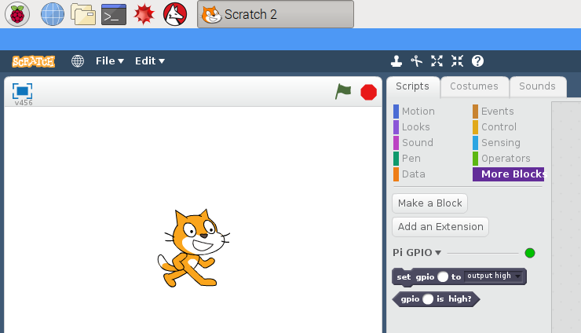

# GPIO in Scratch 2

## Getting started

Open the **More Blocks** panel, click **Add an Extension**, and select **Pi GPIO**. You should then see two new blocks appear:

You can use these two purple blocks to control output pins or read input pins by entering the pin number into the field, or using a variable containing the pin number:

## LED

To control an LED connected to GPIO10, you can use these blocks:

Click the green flag, and the LED will blink on and off repeatedly.

## Button

To read the state of a button connected to GPIO10, you can use these blocks:

Note that the button is pulled up so the GPIO pin will read `high` when it is not pressed, and `low` when it is pressed.

## Button + LED

To connect the LED and button together, you can use these blocks:

