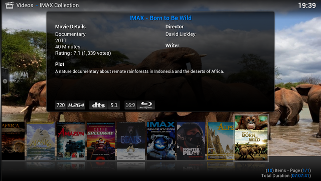
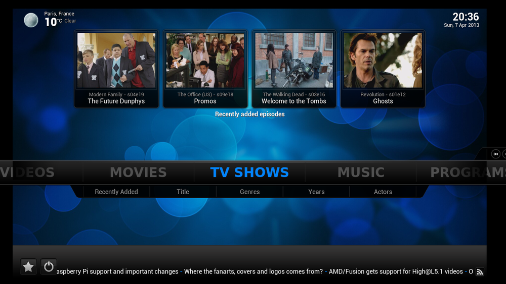
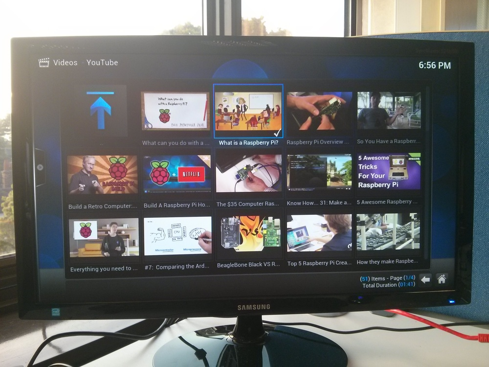

# Using Kodi on the Raspberry Pi

Kodi is media centre software which runs on Raspberry Pi.



Two Kodi distributions are included in our easy operating system installer [NOOBS](../../installation/noobs.md): **LibreELEC** and **OSMC**.

## NOOBS

First, install NOOBS on an SD card. Follow instructions on the [NOOBS](../../installation/noobs.md) page.

With NOOBS on your SD card, you should be able to boot the Raspberry Pi to the NOOBS operating system selection screen:


Select **LibreELEC** or **OSMC** and press the `Install` button.

You'll be prompted to confirm. This will delete any data on the SD card, so if you previously had Raspberry Pi OS on it be sure to back up your files first. If you're sure, click `Yes` to continue and start the installation. This will take some time; when it's complete NOOBS will show a window saying:

```
OS(es) Installed Successfully
```

Click `OK` and your Pi will reboot into the distribution you selected.

## Using Kodi

Now you've got your Kodi distribution installed, you can play media files, configure the system, and install add-ons to add more functionality.

You may be shown a Welcome screen, which will help you configure your setup and get started.



## Power

You can power your Pi the conventional way with a wall socket USB micro cable; alternatively, if your TV has a USB port you can connect the Pi directly with a USB micro cable. This means your Pi will be powered when the TV is turned on, and powered down when the TV is turned off.

## Control

You can use a keyboard and mouse with Kodi, buy a TV remote with a USB receiver, or even use a presentation clicker with directional buttons.

You can also use a Kodi app on your smartphone; search for `Kodi` in your phone's app store. Once configured to connect to your Kodi Pi's IP address, you can use the on-screen remote control or browse the files from your phone and select what to play.

## Playing video files

You can copy video files onto your Pi's SD card, or put them on a USB stick or external hard drive. To play these files, simply choose **VIDEOS** in the slider on the main screen, then **Files**, and you should see your inserted media in the list of sources. Select your device and you should be able to navigate it like you would on a computer. Find the desired video file, select it and it will play.

## Connecting a network drive

You can connect to a network device such as a NAS (Network Attached Storage) on your local network by using a wired connection. Connect your Raspberry Pi to your router with an Ethernet cable. To connect to the device, select **VIDEOS** from the main screen and click **Add Videos...**.

The **Add Video Source** screen will be shown. Select **Browse** and choose the type of connection. For a NAS, choose **Windows network (SMB)**; it will be using the Samba protocol, an open-source implementation of the Windows file share protocol. The device will show up if it can be found on the network. Add this device as a location and you'll be able to navigate its file system and play its media files.

## Settings

Kodi has a host of configurable options. You can change the screen resolution, choose a different skin, set up a screensaver, configure the file view, set localisation options, configure subtitles, and much more. Just go to **SYSTEM** and **Settings** from the main screen.

## Add-ons

Add-ons provide extra functionality or enable connection to web services like YouTube.

The YouTube add-on showing search results:



You can configure add-ons from the settings menu; a selection is available for you to browse. Select one and you'll be prompted to install it. Each add-on has its own configurations.
