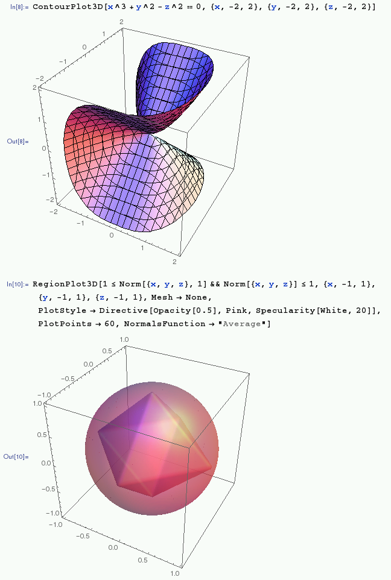
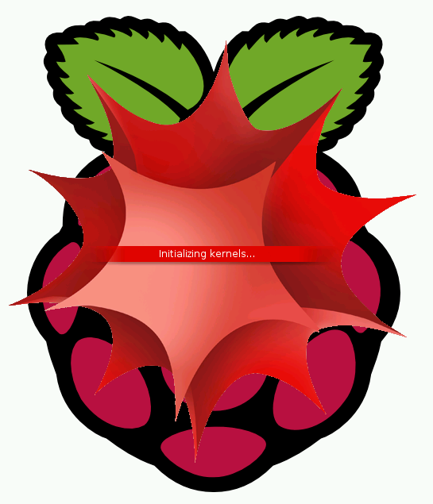
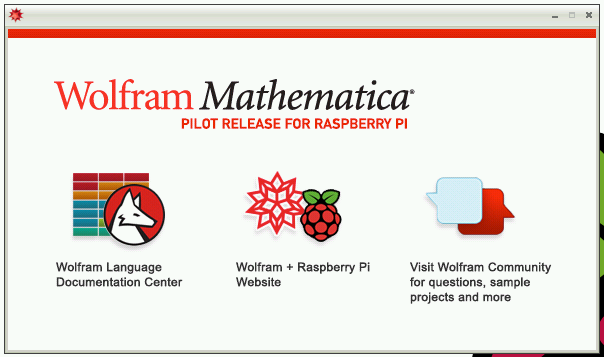
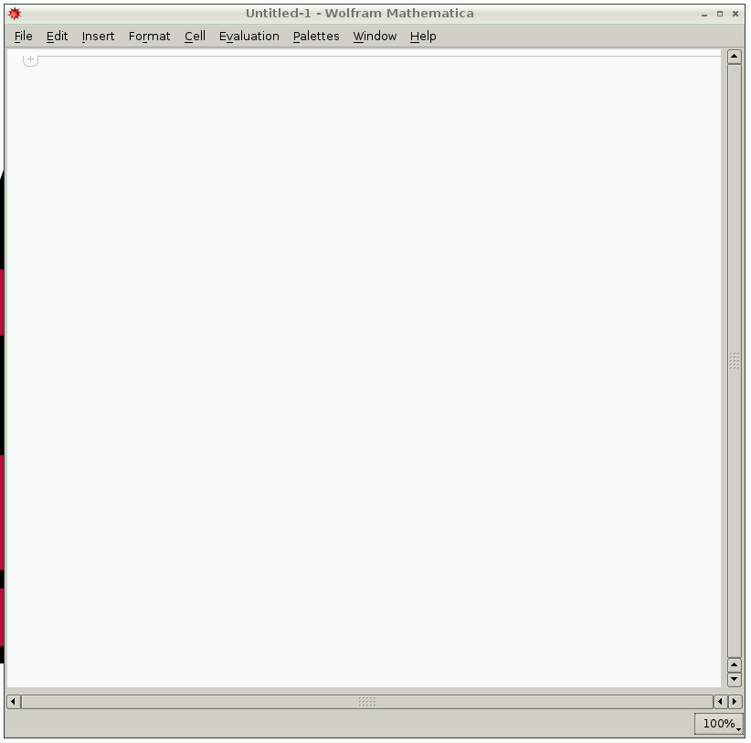
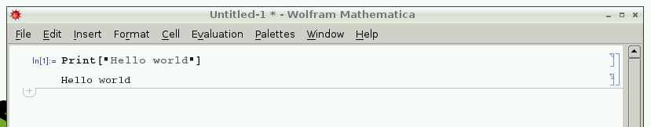
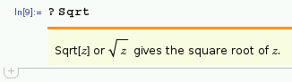
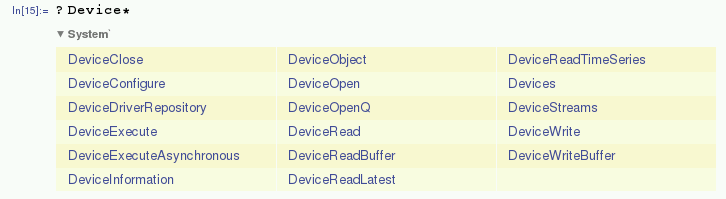
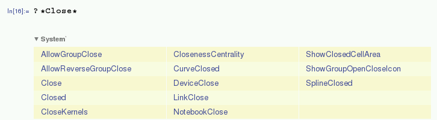
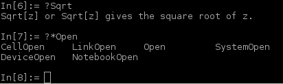
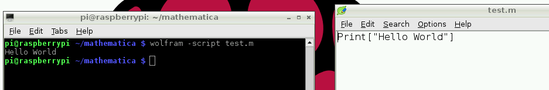

# Mathematica & the Wolfram Language

Mathematica is a computational programming tool used in science, maths, computing and engineering first released in 1988. It is proprietary software that you can use for free on the Raspberry Pi and has been bundled with Raspbian and NOOBS since late 2013. Read the announcement on the Raspberry Pi blog: [The Wolfram Language and Mathematica on Raspberry Pi, for free](http://www.raspberrypi.org/the-wolfram-language-and-mathematica-on-raspberry-pi-for-free/).



If your SD card was updated since late 2013 then you should have Mathematica and Wolfram pre-installed and should see their icons on the Raspbian desktop:


or find the programs in your applications menu under *Education*.

## Installation

If the programs are not installed, please update your system by entering the following commands:

```bash
sudo apt-get update
sudo apt-get install wolfram-engine
```

Note this is a 200MB download so may take some time.

## Mathematica

Double click the `Mathematica` icon on the Desktop or open it from the applications menu to start. You'll see a splash screen with the red mathematica logo while the program loads:



Once loaded, you'll see two windows:

The Wolfram information dialogue:



and the Mathematica notebook:



The Wolfram information dialogue shows web links to:

- [Wolfram Language Documentation Center](http://reference.wolfram.com/language/index.html)
- [Wolfram + Raspberry Pi Website](http://www.wolfram.com/raspberry-pi)
- [Wolfram Community](http://community.wolfram.com/content?curTag=raspberry%20pi)

These links will open in the web browser on the Raspberry Pi, provided you're connected to the internet.

### Programming in Mathematica

Click in to the notebook window and enter:

```
Print["Hello world"]
```

and hit `Shift + Enter` and it will run the command and print "Hello world" to the screen like so:



You can perform mathematical calculations such as:

```
In[2]:= 2 + 2

Out[2]= 4

In[3]:= 16254 / 32

Out[3]= 8127 / 16

In[4]:= 1024 * 32

Out[4]= 32768
```

#### Notebook Editing

You can revisit a previously entered command by clicking it or moving the edit cursor with the keyboard, then delete, edit or add something and hit `Shift + Enter` to execute the new command in its place.

You can save a notebook and come back to it later, send it to a friend, post it online or even hand it in as your homework! Just go to `File > Save As` in the notebook window.

When you open up a saved notebook all the previous entries will be shown, including all the inputs and outputs, and you can execute each cell again with `Shift + Enter` or all at once by selecting `Evaluation > Evaluate Notebook` from the menu.

#### Variables

You can store the results of calculations in variables:

```
radius = 5;
diameter = 2 * radius;
circumference = 2 * Pi * radius;
area = Pi * radius^2;
```

Note the semicolon at the end of each line suppresses the output being printed.

##### Symbolic values

Note the use of the built-in symbol `Pi` which contains a symbolic value of Pi. This means that if you pass it in to an equation the reference to the true value of *Pi* is preserved, not converted to decimal and rounded:

```
In[19]:= Pi

Out[19]: π

In[20]:= tau = 2 * Pi

Out[20]: 2 π
```

To get the decimal representation of a symbolic value, use the `N` function:

```
In[5]:= N[Pi]

Out[5]: 3.14159
```

The default number of significant figures given is 6, but more can be given by specifying in the second argument:

```
In[6]:= N[Pi, 10]

Out[6]: 3.141592654
```

Note this is the number of figures, not decimal places, so the 3 is included in the count, leaving 9 decimal places.

#### Lists

You can store collections of data in a list:

```
nums = {1, 2, 3, 5, 8}
people = {"Alice", "Bob", "Charlotte", "David"}
```

##### Range

The `Range` function can be used to produce a list of numbers:

```
Range[5] (*The numbers 1 to 5*)
Range[2, 5] (*The numbers 2 to 5*)
Range[2, 5, 2] (*The numbers 2 to 5, in steps of 2*)
```

#### Table

The `Table` function is a method of generating the values of a list with a function:

```
Table[i ^ 2, {i, 10}] (*Squares of the numbers 1 to 10*)
Table[i ^ 2, {i, 5, 10}] (*Squares of the numbers 5 to 10*)
Table[i ^ 2, {i, nums}] (*Squares of the items in the list nums*)
```

#### Looping

You can run a loop a number of times, or over the items in a list with `Do`:

```
Do[Print["Hello"], {10}] (*Print "Hello" 10 times*)
Do[Print[i], {i, 5}] (*Print the numbers 1 to 5*)
Do[Print[i], {i, 3, 5}] (*Print the numbers 3 to 5*)
Do[Print[i], {i, 3, 5}] (*Print the numbers 1 to 5, in steps of 2*)
Do[Print[i ^ 2], {i, nums}] (*Print the square of each item in the list nums*)
```

#### Function Help

You can get usage help for a function by prepending the function name with a question mark (`?`) and hitting `Shift + Enter`:



#### Function Search

You can also search for functions by entering part of the function name to find matches. Just start with a (`?`) add an asterisk (`*`) as a wildcard:

```
In[15]:= ?Device*
```



You can use multiple wildcards:

```
In[16]:= ?*Close*
```



#### Comments

As seen in earlier examples, you can leave comments (notes that are ignored in the program) in scripts by using brackets (`(` & `)`) and asterisks (`*`):

```
Print["Hello"] (*Print "Hello" to the screen*)
```

## Wolfram command line access

You can also access the Wolfram language from the command line by entering `wolfram` in the terminal, or double clicking the Wolfram Desktop icon. This will give a text-only (non-graphical) programming environment with the `In[x]` / `Out[x]` style interface but without interactive notebook functionality. The Mathematica functions will still work as expected:



You'll find the command line interface faster to use due to the lack of graphical processing required to run the notebook, but without the interactivity and graphical pretty printing.

To exit, hit `Ctrl + D`.

### Running scripts with Wolfram

You can write a program and save it as a normal file (usually with a `.m` or `.wl` file extension) and execute the script from the command line by adding the `-script` flag.

To run `test.m`:

```bash
wolfram -script test.m
```



## More

See the [next page](advanced.md) for more advanced usage of Mathematica including matrix operations, plotting, GPIO and using the Raspberry Pi camera.

Read about the use of Mathematica and Wolfram on Raspberry Pi on our blog (see [mathematica](http://www.raspberrypi.org/tag/mathematica/), [wolfram](http://www.raspberrypi.org/tag/wolfram/), [wolfram language](http://www.raspberrypi.org/tag/wolfram-language/) and [wolfram research](http://www.raspberrypi.org/tag/wolfram-research/) tags).

Also read up on Mathematica performance on Pi and see benchmark results by Mike Croucher: [Playing with Mathematica on Raspberry Pi](http://www.walkingrandomly.com/?p=5220)
