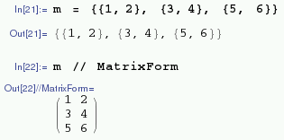
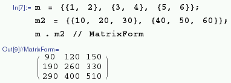
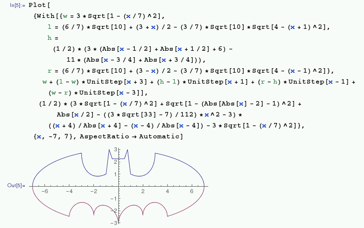
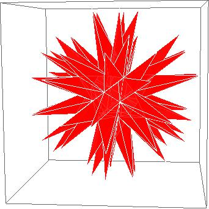
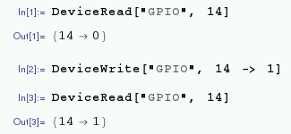

# Advanced Mathematica

## List Operations

You can apply an operation or function to all items in a list:

```
In[21]:= 2 * {1, 2, 3, 4, 5}

Out[21]: {2, 4, 6, 8, 10}

In[22]:= {1, 2, 3, 4, 5} ^ 2

Out[22]: {1, 4, 9, 16, 25}

In[23]:= Sqrt[{1, 2, 3, 4, 5}]

Out[23]: {1, Sqrt[2], Sqrt[3], 2, Sqrt[5]}
```

Note in the last example the square roots of `1` and `4` were given exactly as they yield integer values but the square roots of `2`, `3` and `5`, which are irrational, are given symbolically.

## Matrices

One of the most useful additional components of a mathematical programming language is the ability to do [matrix](https://en.wikipedia.org/wiki/Matrix_(mathematics)) operations. Of course, Mathematica has these available.

To create a matrix, first enter the values as a list of lists, making sure the dimensions are rectangular, i.e. `n x m` where `n` and `m` are integers:

```
m = {{1, 2}, {3, 4}, {5, 6}};
```

You can view this list as a matrix by typing:

```
m // MatrixForm
```



You can perform matrix operations such as [dot product](https://en.wikipedia.org/wiki/Dot_product):

```
m = {{1, 2}, {3, 4}, {5, 6}};
m2 = {{10, 20, 30}, {40, 50, 60}};
m . m2 // MatrixForm
```



## Plotting

You can plot interesting things using Mathematica:



For example, plot an [echidnahedron](http://mathworld.wolfram.com/Echidnahedron.html) with the following command:

```
Graphics3D[{Opacity[.8], Glow[RGBColor[1,0,0]], EdgeForm[White], Lighting -> None, PolyhedronData["Echidnahedron", "Faces"]}]
```



## GPIO

You can access the GPIO pins from Mathematica using the `DeviceWrite` and `DeviceRead` functions.

To access the GPIO pins, you'll need to be running as root, so run `sudo wolfram` from the terminal (this will run the command line `wolfram` environment) or `sudo mathematica &` to run the Mathematica notebook as root.

The following command turns GPIO pin 14 (using BCM pin numbering) on:

```
DeviceWrite["GPIO", 14 -> 1]
```

and the following command turns pin 14 off:

```
DeviceWrite["GPIO", 14 -> 0]
```

You can also read the status of a GPIO input device (to check if a button is pressed, for example) with `DeviceRead`, much the same way:

```
button = DeviceRead["GPIO", 14]
```

The variable `button` should now contain `0` for off or `1` for on.



Read more about GPIO in general on the [GPIO usage](../gpio/README.md) page.

## Camera

You can take pictures with the camera using the `DeviceRead` function. First, attach your camera as usual. Follow the [camera setup guide](http://www.raspberrypi.org/help/camera-module-setup/).

To take a still picture with the camera, type the following command:

```
img = DeviceRead["RaspiCam"]
```

Then to save the image as a file, use `Export` and supply the save path and the variable containing the image:

```
Export["/home/pi/img.jpg", img]
```

## More

Read about the use of Mathematica and Wolfram on Raspberry Pi on our blog (see [mathematica](http://www.raspberrypi.org/tag/mathematica/), [wolfram](http://www.raspberrypi.org/tag/wolfram/), [wolfram language](http://www.raspberrypi.org/tag/wolfram-language/) and [wolfram research](http://www.raspberrypi.org/tag/wolfram-research/) tags).

Also read up on Mathematica performance on Pi and see benchmark results by Mike Croucher: [Playing with Mathematica on Raspberry Pi](http://www.walkingrandomly.com/?p=5220)
