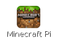
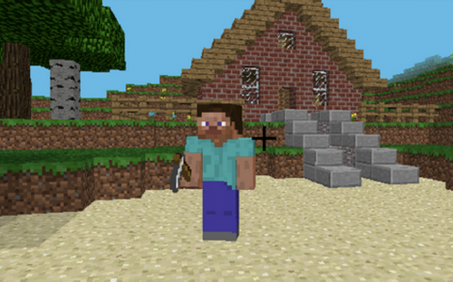

# Minecraft Pi

Minecraft is a popular sandbox open world-building game. A free version of Minecraft is available for the Raspberry Pi; it is the only edition of the game with a programming interface. This means you can write commands and scripts in Python code to build things in the game, automatically as well as manually.


## Installation

Minecraft may be installed by default with a desktop shortcut.



If not, open a terminal window and type the following commands (you must be online):

```bash
sudo apt-get update
sudo apt-get install minecraft-pi
```

Once that finishes, Minecraft Pi and the Python library should be installed.

## Run

To run Minecraft double click on the desktop icon.

When Minecraft Pi has loaded, click on **Start Game**, followed by **Create new**.

You are now in a game of Minecraft! Go walk around, hack things, and build things!

## Programming interface

With Minecraft running, return to your terminal window and open a new tab by clicking **File** and **New Tab**.

Now open the Python interpreter by typing `python` and pressing Enter. With the Python interpreter loaded, start by importing the Minecraft library. 

You can either type commands in Python's interactive mode, or create a file with a list of commands, then execute the file at will. See more about [using Python](../python/README.md).

Next, import the Minecraft library with the following command:

```python
import mcpi.minecraft as minecraft
```

With the library available, you can connect to your game with:

```python
mc = minecraft.Minecraft.create()
```

### Post a message

To post a message to the screen for all players in the game on the network to see, type the following Python command:

```python
mc.postToChat("Type your message here")
```

### Find your location

To find your location, type:

```python
pos = mc.player.getPos()
```

`pos` now contains your location; access each part of the set of coordinates with `pos.x`, `pos.y` and `pos.z`.

Alternatively, a nice way to get the coordinates into separate variables is to use Python's unpacking technique:

```python
x, y, z = mc.player.getPos()
```

Now `x`, `y`, and `z` contain each part of your position coordinates.

### Set blocks

You can set blocks at a given set of coordinates with `mc.setBlock(x, y, z)`:

```python
x, y, z = mc.player.getPos()
mc.setBlock(x + 1, y, z)
```

Now a block should appear beside where you're standing. Note that you should call for your position each time, so you can move about and draw things in different places.

Try this in a loop:

```python
x, y, z = mc.player.getPos()

for dx in range(1, 101):
    for dy in range(1, 101):
        for dz in range(100):
            mc.setBlock(x + dx, y + dy, z + dz)
```

This should draw a 100x100 cube beside you. Try adjusting the ranges to skip every other block:

```python
x, y, z = mc.player.getPos()

for dx in range(1, 101, 2):
    for dy in range(1, 101, 2):
        for dz in range(100, 2):
            mc.setBlock(x + dx, y + dy, z + dz)
```



## API reference

See an API reference at [stuffaboutcode.com](http://www.stuffaboutcode.com/p/minecraft-api-reference.html).

---

Note: Minecraft was previously installed by downloading the files with `wget`. These instructions has been updated as the installation is now possible with Raspbian's package manager.

Previously any Python code accessing the API had to be saved in the `api/python` folder. Now you can save the Python code wherever you like.

If you installed Minecraft the old way, you should delete the folder with `rm -rf mcpi` from the home folder, and follow the instructions above to install the new way.
