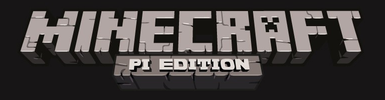

# Minecraft Pi

Minecraft is a popular sandbox open world building game. A free version of Minecraft is available for the Raspberry Pi; it also comes with a programming interface. This means you can write commands and scripts in Python code to build things in the game automatically. It's a great way to learn Python!

See the [Getting Started with Minecraft Pi](https://www.raspberrypi.org/learning/getting-started-with-minecraft-pi/) learning resource for instructions on using Minecraft Pi.
