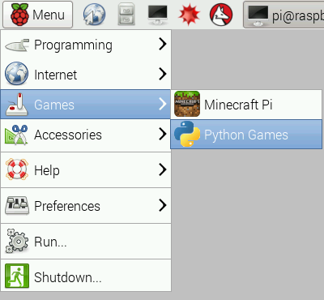
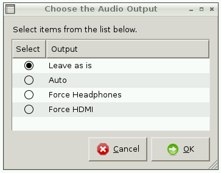
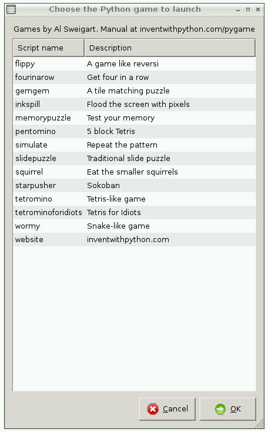
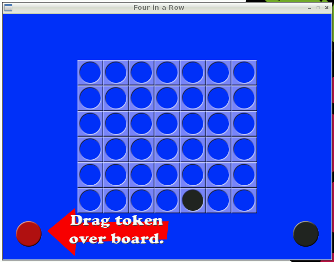
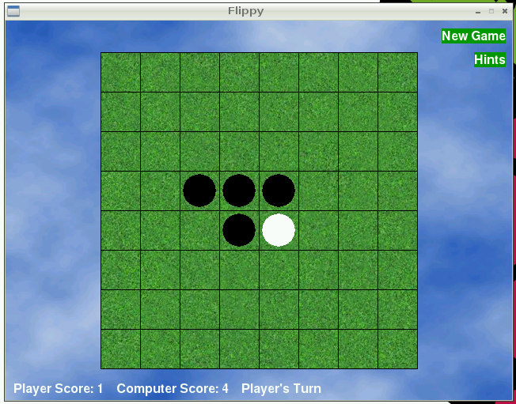
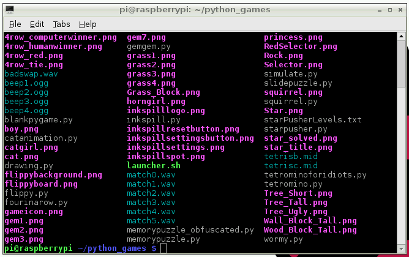
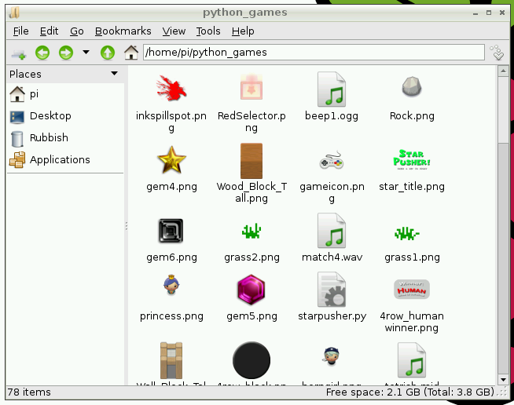

# Python Games

You'll find Python Games on the Desktop or in the application menu:

Double click this icon to start. This will prompt you to set your audio configuration to output sound over HDMI or the headphone jack. Make a selection or leave it as it is and click `OK` to proceed.

Now you'll be shown a tall window with the list of games available:

Pick a game, click it and hit `OK` to play.

## Examples

### Four in a Row

### Flippy

## Game source code

The source of each of these games is available on the Pi. Simply navigate to the directory `/usr/share/python_games` in a terminal or the file manager and you'll see the assets and source code.

The `python_games` directory listing in a terminal window:

The `python_games` folder contents in a the file manager window:

You can open up the Python source code for any of the games in Thonny, or any other editor, and see how they work.

### Hack the game

You can edit the source of these games. Why not make a copy of a Python file, look through the code and change some numbers? See what happens.

For more free games check out [Free Python Games](http://www.grantjenks.com/docs/freegames/), which are designed for education and fun. They include simplified versions of arcade classics like Tron, Pac-Man, and more.

If you can figure out how the game works, try to hack it to make it better, make it harder (or easier) to win, or add some features to the game! You could add [GPIO](../gpio/README.md) interaction so lights flash when you win, or add input buttons.
