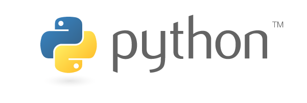
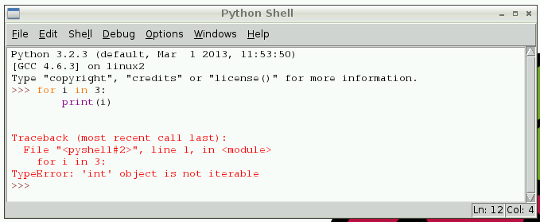
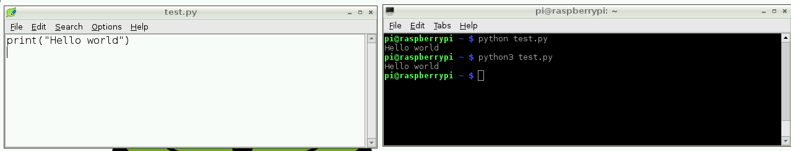
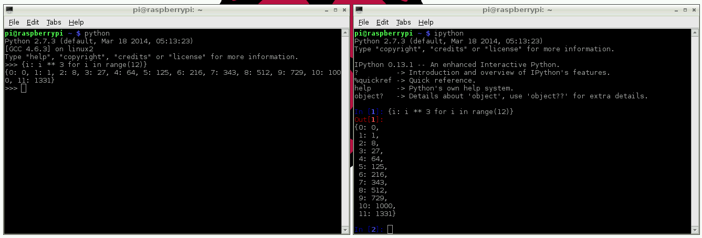

# Python

Python is a wonderful and powerful programming language that's easy to use (easy to read **and** write) and, with Raspberry Pi, lets you connect your project to the real world.



Python syntax is very clean, with an emphasis on readability, and uses standard English keywords. 

## Thonny

The easiest introduction to Python is through Thonny, a Python3 development environment. Open Thonny from the Desktop or applications menu:

Thonny gives you a REPL (Read-Evaluate-Print-Loop), which is a prompt you can enter Python commands into. Because it's a REPL, you even get the output of commands printed to the screen without using `print`. In the Thonny application, this is called the Shell window.

You can use variables if you need to but you can even use it like a calculator. For example:

```python
>>> 1 + 2
3
>>> name = "Sarah"
>>> "Hello " + name
'Hello Sarah'
```

Thonny also has syntax highlighting built in and some support for autocompletion. You can look back on the history of the commands you've entered in the REPL with `Alt + P` (previous) and `Alt + N` (next).

## Basic Python usage

Hello world in Python:

```python
print("Hello world")
```

Simple as that!

### Indentation

Some languages use curly braces `{` and `}` to wrap around lines of code which belong together, and leave it to the writer to indent these lines to appear visually nested. However, Python does not use curly braces but instead requires indentation for nesting. For example a `for` loop in Python:

```python
for i in range(10):
    print("Hello")
```

The indentation is necessary here. A second line indented would be a part of the loop, and a second line not indented would be outside of the loop. For example:

```python
for i in range(2):
    print("A")
    print("B")
```

would print:

```
A
B
A
B
```

whereas the following:

```python
for i in range(2):
    print("A")
print("B")
```

would print:

```
A
A
B
```

### Variables

To save a value to a variable, assign it like so:

```python
name = "Bob"
age = 15
```

Note that data types were not specified with these variables, as types are inferred, and can be changed later.

```python
age = 15
age += 1  # increment age by 1
print(age)
```

This time I used comments beside the increment command.

### Comments

Comments are ignored in the program but there for you to leave notes, and are denoted by the hash `#` symbol. Multi-line comments use triple quotes like so:

```python
"""
This is a very simple Python program that prints "Hello".
That's all it does.
"""

print("Hello")
```

### Lists

Python also has lists (called arrays in some languages) which are collections of data of any type:

```python
numbers = [1, 2, 3]
```

Lists are denoted by the use of square brackets `[]` and each item is separated by a comma.

### Iteration

Some data types are iterable, which means you can loop over the values they contain. For example a list:

```python
numbers = [1, 2, 3]

for number in numbers:
    print(number)
```

This takes each item in the list `numbers` and prints out the item:

```
1
2
3
```

Note I used the word `number` to denote each item. This is merely the word I chose for this - it's recommended you choose descriptive words for variables - using plurals for lists, and singular for each item makes sense. It makes it easier to understand when reading.

Other data types are iterable, for example the string:

```python
dog_name = "BINGO"

for char in dog_name:
    print(char)
```

This loops over each character and prints them out:

```
B
I
N
G
O
```

### Range

The integer data type is not iterable and trying to iterate over it will produce an error. For example:

```python
for i in 3:
    print(i)
```

will produce:

```python
TypeError: 'int' object is not iterable
```



However you can make an iterable object using the `range` function:

```python
for i in range(3):
    print(i)
```

`range(5)` contains the numbers `0`, `1`, `2`, `3` and `4` (five numbers in total). To get the numbers `1` to `5` (inclusive) use `range(1, 6)`.

### Length

You can use functions like `len` to find the length of a string or a list:

```python
name = "Jamie"
print(len(name))  # 5

names = ["Bob", "Jane", "James", "Alice"]
print(len(names))  # 4
```

### If statements

You can use `if` statements for control flow:

```python
name = "Joe"

if len(name) > 3:
    print("Nice name,")
    print(name)
else:
    print("That's a short name,")
    print(name)
```

## Python files in Thonny

To create a Python file in Thonny, click `File > New` and you'll be given a <untitled> window. This is an empty file, not a Python prompt. You write a Python file in this window, save it, then run it and you'll see the output in the other window.

For example, in the new window, type:

```python
n = 0

for i in range(1, 101):
    n += i

print("The sum of the numbers 1 to 100 is:")
print(n)
```

Then save this file (`File > Save` or `Ctrl + S`) and run (`Run > Run Module` or hit `F5`) and you'll see the output in your original Python window.

## Executing Python files from the command line

You can write a Python file in a standard [editor](../../linux/usage/text-editors.md), and run it as a Python script from the command line. Just navigate to the directory the file is saved in (use `cd` and `ls` for guidance) and run with `python3`, e.g. `python3 hello.py`.



## Other ways of using Python

### Command Line

The standard built-in Python shell is accessed by typing `python3` in the terminal.

This shell is a prompt ready for Python commands to be entered. You can use this in the same way as Thonny, but it does not have syntax highlighting or autocompletion. You can look back on the history of the commands you've entered in the REPL by using the <kbd>Up/Down</kbd> keys. Use `Ctrl + D` to exit.

### IPython

IPython is an interactive Python shell with syntax highlighting, autocompletion, pretty printing, built-in documentation, and more. IPython is not installed by default. Install with:

```bash
sudo pip3 install ipython
```

Then run with `ipython` from the command line. It works like the standard `python3`, but has more features. Try typing `len?` and hitting `Enter`. You're shown information including the docstring for the `len` function:

```python
Type:       builtin_function_or_method
String Form:<built-in function len>
Namespace:  Python builtin
Docstring:
len(object) -> integer

Return the number of items of a sequence or mapping.
```

Try the following dictionary comprehension:

```python
{i: i ** 3 for i in range(12)}
```

This will pretty print the following:

```python
{0: 0,
 1: 1,
 2: 8,
 3: 27,
 4: 64,
 5: 125,
 6: 216,
 7: 343,
 8: 512,
 9: 729,
 10: 1000,
 11: 1331}
```

In the standard Python shell, this would have printed on one line:

```python
{0: 0, 1: 1, 2: 8, 3: 27, 4: 64, 5: 125, 6: 216, 7: 343, 8: 512, 9: 729, 10: 1000, 11: 1331}
```



You can look back on the history of the commands you've entered in the REPL by using the <kbd>Up/Down</kbd> keys like in `python`. The history also persists to the next session, so you can exit `ipython` and return (or switch between v2/3) and the history remains. Use `Ctrl + D` to exit.

## Installing Python libraries

### apt

Some Python packages can be found in the Raspberry Pi OS archives, and can be installed using apt, for example:

```bash
sudo apt update
sudo apt install python-picamera
```

This is a preferable method of installing, as it means that the modules you install can be kept up to date easily with the usual `sudo apt update` and `sudo apt full-upgrade` commands.

### pip

Not all Python packages are available in the Raspberry Pi OS archives, and those that are can sometimes be out of date. If you can't find a suitable version in the Raspberry Pi OS archives, you can install packages from the [Python Package Index](http://pypi.python.org/) (known as PyPI).

To do so, install pip:

```bash
sudo apt install python3-pip
```

Then install Python packages (e.g. `simplejson`) with `pip3`:

```bash
sudo pip3 install simplejson
```

Read more on installing software in Python [here](../../linux/software/python.md).

#### piwheels

The official Python Package Index (PyPI) hosts files uploaded by package maintainers. Some packages require compilation (compiling C/C++ or similar code) in order to install them, which can be a time-consuming task, particlarly on the single-core Raspberry Pi 1 or Pi Zero.

piwheels is a service providing pre-compiled packages (called *Python wheels*) ready for use on the Raspberry Pi. Raspberry Pi OS is pre-configured to use piwheels for pip. Read more about the piwheels project at [www.piwheels.org](https://www.piwheels.org/).

## More

- [GPIO with Python](../gpio/python/README.md)
- [Official Python website](https://www.python.org/)
- [Official Python documentation](https://www.python.org/doc/)
