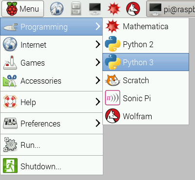

# Python

Python is a wonderful and powerful programming language that's easy to use (easy to read **and** write) and with Raspberry Pi lets you connect your project to the real world.


Python syntax is very clean, with an emphasis on readability and uses standard English keywords. Start by opening IDLE from the desktop.

## IDLE

The easiest introduction to Python is through IDLE, a Python development environment. Open IDLE from the Desktop or applications menu:



IDLE gives you a REPL (Read-Evaluate-Print-Loop) which is a prompt you can enter Python commands in to. As it's a REPL you even get the output of commands printed to the screen without using `print`.

*Note two versions of Python are available: Python 2 and Python 3. Python 3 is the newest version and is recommended, however Python 2 is available for legacy applications which do not support Python 3 yet. For the examples on this page you can use Python 2 or 3 (see [Python 2 vs. Python 3](more.md)).*

You can use variables if you need to but you can even use it like a calculator. For example:

```python
>>> 1 + 2
3
>>> name = "Sarah"
>>> "Hello " + name
'Hello Sarah'
```

IDLE also has syntax highlighting built in and some support for autocompletion. You can look back on the history of the commands you've entered in the REPL with `Alt + P` (previous) and `Alt + N` (next).

## Basic Python usage

Hello world in Python:

```python
print("Hello world")
```

Simple as that!

### Indentation

Some languages use curly braces `{` and `}` to wrap around lines of code which belong together, and leave it to the writer to indent these lines to appear visually nested. However, Python does not use curly braces but instead requires indentation for nesting. For example a `for` loop in Python:

```python
for i in range(10):
    print("Hello")
```

The indentation is necessary here. A second line indented would be a part of the loop, and a second line not indented would be outside of the loop. For example:

```python
for i in range(2):
    print("A")
    print("B")
```

would print:

```
A
B
A
B
```

whereas the following:

```python
for i in range(2):
    print("A")
print("B")
```

would print:

```
A
A
B
```

### Variables

To save a value to a variable, assign it like so:

```python
name = "Bob"
age = 15
```

Note here I did not assign types to these variables, as types are inferred, and can be changed (it's dynamic).

```python
age = 15
age += 1  # increment age by 1
print(age)
```

This time I used comments beside the increment command.

### Comments

Comments are ignored in the program but there for you to leave notes, and are denoted by the hash `#` symbol. Multi-line comments use triple quotes like so:

```python
"""
This is a very simple Python program that prints "Hello".
That's all it does.
"""

print("Hello")
```

### Lists

Python also has lists (called arrays in some languages) which are collections of data of any type:

```python
numbers = [1, 2, 3]
```

Lists are denoted by the use of square brackets `[]` and each item is separated by a comma.

### Iteration

Some data types are iterable, which means you can loop over the values they contain. For example a list:

```python
numbers = [1, 2, 3]

for number in numbers:
    print(number)
```

This takes each item in the list `numbers` and prints out the item:

```
1
2
3
```

Note I used the word `number` to denote each item. This is merely the word I chose for this - it's recommended you choose descriptive words for variables - using plurals for lists, and singular for each item makes sense. It makes it easier to understand when reading.

Other data types are iterable, for example the string:

```python
dog_name = "BINGO"

for char in dog_name:
    print(char)
```

This loops over each character and prints them out:

```
B
I
N
G
O
```

### Range

The integer data type is not iterable and tryng to iterate over it will produce an error. For example:

```python
for i in 3:
    print(i)
```

will produce:

```python
TypeError: 'int' object is not iterable
```


However you can make an iterable object using the `range` function:

```python
for i in range(3):
    print(i)
```

`range(5)` contains the numbers `0`, `1`, `2`, `3` and `4` (five numbers in total). To get the numbers `1` to `5` use `range(1, 6)`.

### Length

You can use functions like `len` to find the length of a string or a list:

```python
name = "Jamie"
print(len(name))  # 5

names = ["Bob", "Jane", "James", "Alice"]
print(len(names))  # 4
```

### If statements

You can use `if` statements for control flow:

```python
name = "Joe"

if len(name) > 3:
    print("Nice name,")
    print(name)
else:
    print("That's a short name,")
    print(name)
```

## Python files in IDLE

To create a Python file in IDLE, click `File > New File` and you'll be given a blank window. This is an empty file, not a Python prompt. You write a Python file in this window, save it, then run it and you'll see the output in the other window.

For example, in the new window, type:

```python
n = 0

for i in range(1, 101):
    n += i

print("The sum of the numbers 1 to 100 is:")
print(n)
```

Then save this file (`File > Save` or `Ctrl + S`) and run (`Run > Run Module` or hit `F5`) and you'll see the output in your original Python window.

## Executing Python files from the command line

You can write a Python file in a standard [editor](../../linux/usage/text-editors.md) like Vim, Nano or LeafPad, and run it as a Python script from the command line. Just navigate to the directory the file is saved (use `cd` and `ls` for guidance) and run with `python`, e.g. `python hello.py`.


## More

See [more advanced](more.md) information covering:

- Python 2 vs. Python 3
- Convention
- Other ways of using Python
- Installing Python libraries
- GPIO

Also see the page on running the preinstalled [Python Games](../python-games/README.md)

## Python Documentation

Full documentation for Python is available at [python.org/doc](https://www.python.org/doc/)
