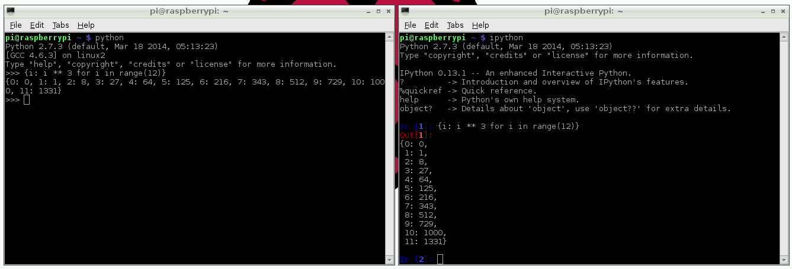

# More on Python

## Python 2 vs. Python 3

The short version: Python 2 is legacy, Python 3 is the present and future of the language.

Python 2 was released in 2000, and Python 3 was released in 2008. Python 3 is recommended, but some libraries have not yet been ported to Python 3 which is why Python 2 is still present and widely used.

If you are familiar with Python 2 but not Python 3, here is a summary of the basic key differences:

- Print
    - In Python 2, `print` is a statement and did not require brackets, e.g. `print "Hello"`.
    - In Python 3, `print` is a function, so you pass in what you want to print as parameters, e.g. `print("Hello")` or `print("My age is", age)`.
    - Using brackets for `print` in Python 2 works fine, so it's common to see this used for compatibility. However printing multiple objects in the same `print` command works differently.
    - In Python 3 this prints each one, space separated, and in Python 2 the collection of items is printed as a tuple, e.g. `("My age is", 15)`
-  Input / Raw input
    -  In Python 2, the function `raw_input` takes input from the user.
    -  In Python 3, the function is called `input`.
- Integer division
    - In Python 2 `/` is used for exact integer division, always returning an integer. This means it returns the value of the number of times one number divides in to another whole, and ignores the remainder, e.g. `1 / 2` returns `0`, `2 / 2` returns `1` and `3 / 2` returns `1`.
    - In Python 3, `/` does 'true' division, returning a floating point number (decimal), e.g. `1 / 2` returns `0.5`.
    - To get floating point division in Python 2, convert one or both numbers to a float first, e.g. `1.0 / 2` which returns `0.5`.
    - To get exact integer division in Python 3, use `//`, e.g. `1 // 2` returns `0`.

Python 2.7.6 was released in 2013. The 2.x branch will have no further major releases.

Read more on the differences on the [Python wiki](https://wiki.python.org/moin/Python2orPython3)

## Convention

While indentation is essential in Python, there are other aspects which are syntactically correct but considered bad practise. These are given in a style guide called [PEP 8](http://legacy.python.org/dev/peps/pep-0008/) and include conventions such as always using spaces around operators i.e. `a = 1 + 2` over `a=1+2` and a maximum line length of 79 characters. It also suggests using four spaces per tab (this is configurable in your editor).

The philosophy of Python is summarised in [PEP 20](http://legacy.python.org/dev/peps/pep-0020/) (The Zen of Python) which encourages good Pythonic writing style. For example:

- Beautiful is better than ugly
- Explicit is better than implicit
- Simple is better than complex
- Complex is better than complicated
- Readability counts

## Other ways of using Python

### Command Line

The standard built-in Python REPL is accessed by typing `python` in the Terminal. Type `python3` for Python 3.

This REPL is a prompt ready for Python commands to be entered. You can use this the same as IDLE, but it does not have syntax highlighting or autocompletion. You can look back on the history of the commands you've entered in the REPL by using the Up/Down keys. Use `Ctrl + D` to exit.

### IPython

An alternative command line Python prompt is IPython. IPython is an interactive Python shell with syntax highlighting, autocompletion, pretty printing, built-in documentation and more. IPython is not installed by default. Install with:

```
sudo apt-get install ipython
```

or for Python 3:

```
sudo apt-get install ipython3
```

Then run with `ipython` or `ipython3` from the command line. It works like the standard `python`, but with more features. Try typing `len?` and hitting `Enter`. You're shown information including the docstring for the `len` function:

```python
Type:       builtin_function_or_method
String Form:<built-in function len>
Namespace:  Python builtin
Docstring:
len(object) -> integer

Return the number of items of a sequence or mapping.
```

Try the following dictionary comprehension:

```python
{i: i ** 3 for i in range(12)}
```

which will pretty print the following:

```python
{1: 1,
 2: 8,
 3: 27,
 4: 64,
 5: 125,
 6: 216,
 7: 343,
 8: 512,
 9: 729,
 10: 1000,
 11: 1331}
```

In `python` this would have printed on one line:

```python
{1: 1, 2: 8, 3: 27, 4: 64, 5: 125, 6: 216, 7: 343, 8: 512, 9: 729, 10: 1000, 11: 1331}
```



You can look back on the history of the commands you've entered in the REPL by using the Up/Down keys like in `python` but it also persists over sessions, so you can exit `ipython` and return (or switch between v2/3) and the history remains. Use `Ctrl + D` to exit.

## Installing Python libraries

### APT

Some Python packages can be found in the Raspbian archives, and can be installed using APT, for example:

```bash
sudo apt-get update
sudo apt-get install python-picamera
```

This is a preferable method of installing things as it means that the modules you install can be kept up to date easily with the usual `sudo apt-get update` and `sudo apt-get upgrade` commands.

### Pip

Not all Python packages are available in the Raspbian archives, and those that are can sometimes be out of date. If you can't find a suitable version in the Raspbian archives you can install packages from the [Python Package Index](http://pypi.python.org/) (also known as PyPI). To do so, use the `pip` tool (which is installed with the `python-pip` package in Raspbian:

```bash
sudo apt-get install python-pip
sudo pip install simplejson
```

Read more on [installing software in Python](../../linux/software/python.md)

## GPIO

Using Python on the Raspberry Pi opens up the opportunity to connect to the real world through the Pi's GPIO pins. This can be done with the RPi GPIO library. It is preinstalled on recent Raspbian images, but if you have an older one you can install it with:

```bash
sudo apt-get install python-rpi.gpio
```

or

```bash
sudo apt-get install python3-rpi.gpio
```

To control the GPIO pins you'll need root access, so run `sudo python`, `sudo ipython` or `sudo idle &`.

In your Python script (or in the REPL), import the GPIO module, set the board mode to that of your preference, set up the pins you want to use and turn them on:

```python
import RPi.GPIO as GPIO

GPIO.setmode(GPIO.BCM)  # set board mode to Broadcom

GPIO.setup(17, GPIO.OUT)  # set up pin 17
GPIO.setup(18, GPIO.OUT)  # set up pin 18

GPIO.output(17, 1)  # turn on pin 17
GPIO.output(18, 1)  # turn on pin 18
```
