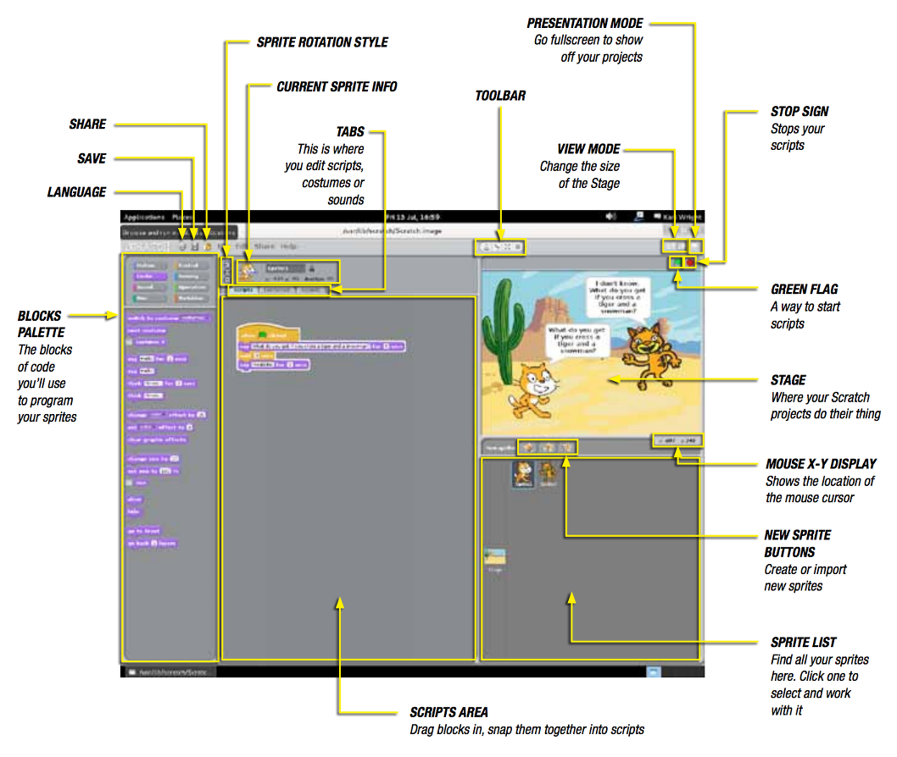
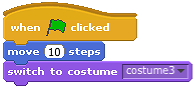

# Scratch

Scratch is a visual programming tool which allows the user to create animations and games with a drag-and-drop interface. It allows you to create your own computer games, interactive stories, and animations using some programming techniques without actually having to write code. It’s a great way to get started programming on the Raspberry Pi with young people. To find out more about Scratch, visit the website at [scratch.mit.edu](http://scratch.mit.edu) or see the [Computing At School Raspberry Pi Education Manual](http://pi.cs.man.ac.uk/download/Raspberry_Pi_Education_Manual.pdf).

## Getting started

You'll find Scratch on the desktop of Raspbian and in the applications menu under **Education**. Once opened you will see a window like this:

## Make the Scratch cat move

The cat in the white preview window is an example of a **sprite** in Scratch. Currently the Scratch cat sprite is on a blank **stage**. Let's get the cat to move.

1. Click on the Scratch cat sprite.
2. Then click on the blocks palette and select **Control**.
3. Next drag a **When green flag clicked** block and place it on the scripts area in the middle of the screen.
4. Add a blue **Move 10 steps** block from the **Motion** blocks palette and connect it to the **When green flag clicked** block.
5. Now click the green flag icon in the top right hand side of the screen and see the cat move!
6. How would you get the cat to move further?

## Changing the way the sprite looks

All sprites in Scratch can wear different costumes.

1. Click on your sprite to select it. In the **Scripts** area in the middle of the screen, click on the **Costumes** tab.
2. You will see that the cat has two costumes. Click on Copy to make a third costume and a new cat costume should appear.
3. Select **costume3** and click on **Edit**. This will open the **Paint Editor**. Experiment with all the buttons and tools to find out what they do.
4. Next, draw some clothes on the costume and click **OK**.
5. To switch between costumes, click on the **Scripts** tag. Add the purple **Looks** block, **Switch to Costume**, to the other blocks and connect it.
6. Select **costume3** from the drop-down menu on the purple block.
7. Now run your program to see the costume change.

## Add Sprites

If you feel that the Scratch cat sprite does not suit your needs then you can add other sprites, or even create your own!

1. At the top of the Sprites palette are three icons to create a new sprite.
2. The first allows you to **Paint your own sprite**. Click on this and it will open the **Paint Editor** window. Here you can use shapes, lines, and freehand drawings to make fun characters.
3. The second icon allows you to **Choose a new sprite** from those already built into Scratch or saved on your Raspberry Pi. Click on this, and you will be able to navigate to the folders containing those sprites and select one you like.
4. The third icon will, when clicked, give you a **surprise sprite**. Click this and see what happens!

