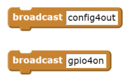

# Scratch GPIO

The September 2015 release of Scratch for the Pi, included in the Raspbian Jessie release, introduces a new GPIO server to make driving LEDs, buzzers, HATS and other devices and components easier.

## GPIO Server

### Usage and basic capabilities

Before you can use the GPIO pins you *must* start the GPIO server. There are several ways to do this:

- Choose *Start GPIO server* from the *Edit* menu to turn it on. If the server is running then *Stop GPIO server* will turn it off.
- A Scratch broadcast of `gpioserveron` or `gpioserveroff` will have the same effect.
- Projects saved when the GPIO server is running will have that status recorded and, on loading, will try to start the server if it is enabled.

Without any further setup, you now have access to the basics of the GPIO system. This currently uses the broadcast blocks. For instance, to configure GPIO pin 4 as an output and turn it on, you create the two following broadcasts:

As always, you can assemble this text with normal join, pick or list handling blocks. For example, if `foo` = 17, then

   

would broadcast `gpio17on` and thus set the GPIO pin number 17 (under the BCM numbering) to on.

However, the pins need configuring before you can use them to do anything. We can set the direction of the pin (in, out, outputpwm) and for input pins the pull-up mode (up, down, none). Currently, the pins are only configurable via broadcasts.
For example:     

  

Pins set to be inputs are connected to the Scratch sensor variable system, and so they appear in the list of possible values in the sensor blocks:  

  

and can be used in the same manner:  

  

With these very simple commands, you can build fairly complex GPIO handling scripts. As an example of other, less traditionally GPIO uses for this system, we also have commands to return the time, return the machine IP address, and even take a photo with an attached Pi camera and set it as the current costume.

This script:  

  

illustrates most of the above. Along with a suitably configured breadboard, it provides the ability to turn LEDs on and off with a button, take a photo with a countdown provided by a progressively brightening LED, ways to check the time and so on. Note that we can have a single broadcast that includes several messages, such as `gpio24on gpio18pwm400` above. The text will be split on the spaces and treated as a list of independent broadcasts.

### Basic commands

In the command listings below, we use `[comm] + pin number + [ on | off]` to indicate a command of the form `comm17off` or `comm7on`.  
For a variable, `led + light number (1..5) =  ( 0 .. 100)` indicates a variable named `led5` may have a value from 0 to 100. Likewise, `foo = ( 1 | 4 | 7 )` indicates the variable `foo` may be set to 1, 4 or 7.

The basic GPIO layer command list is:

- config + pin number +
    + `in`, `input`, `inpullup` or `inputpullup` to set as input with pull-up
    +  `inpulldown` or `inputpulldown`
    + `inpullnone` or `inputpulldown`
    + `out` or `output` to set as digital output
    + `outputpwm` to set as a PWM pin

For example, `config12in`.  

- gpio + pin number + [ `on` | `high` | `off` | `low` ]

For example, `gpio17on`.

- gpio + pin number + pwm + [ 0..1024 ] \(we can use the software-driven PWM output facility)

For example, `gpio22pwm522`.

- `gettime`
- `getip`
- `photo`

### Add-on hardware

We can also plug in Pi add-on boards such as the PiGlow, Pibrella, Explorer HAT, etc. To set up a board, we first need to inform the GPIO server what board it is; this is done by creating and setting a variable `AddOn`, like this:  

Each board has its own set of commands layered on top of the basic GPIO facilities described above. In principle, the driver for a board could usurp a basic command such as ‘gpio’ and there may need to be a mechanism added to prevent this.

Many boards can also make use of the Scratch variable broadcast facility, whereby a suitably named variable is created and its value is broadcast when it changes. For example, for a PiGlow board it makes sense to have variables named for each LED or ring of LEDs, and to set the value as a way of controlling the brightness. It's possible to cause confusion by using both forms of control at the same time; broadcasting `myCommand400` in the same script as setting `myValue` to 200 might result in flickering, apparent non-function or even hardware failure in extreme cases. All you need to do is create a variable of the appropriate name and set its value.

Some boards provide inputs that can be accessed via the sensor variables, as shown above in the example usage of pin 11.

#### PiGlow

The PiGlow board has several rings of brightly coloured LEDs that can be controlled as rings, legs, individually or all together. Beware - it can be a bit bright to look at so a diffuser is a good idea. To use the board, set `AddOn` to `PiGlow`.

PiGlow has quite a few commands:

- `leg + leg number [ 1 | 2 | 3 ] + [ on | high | off | low ]` e.g. `leg2off`
- `arm` - as leg
- `all +  [ on | high | off | low ]`
- `[ led | light ] + led number +  [ on | high | off | low ]` e.g. `light12high`
- `bright + [ 0 .. 255 ]` (sets the brightness multiplier for any subsequent LED on command)
- `[ red | orange | yellow | green | blue | white ] +  [ on | high | off | low ]` e.g. `redlow`

and for variables:

- `bright = ( 0 .. 255)`
- `[ leg | arm ] + [ 1 | 2 | 3 ] = (0 .. 255)`
- `[ led | light ] + led number (1..18) = (0 .. 255)`
- `[ red | orange | yellow | green | blue | white ] = ( 0 .. 255)`
- `ledpattern` = (an 18-character string treated as a binary number such as ‘011111101010101010’, where anything not 0 is considered a 1)

#### PiFace

The Piface Digital board provides 8 digital inputs and 8 digital outputs, with the first 4 inputs having parallel switches and the first 2 outputs having 20V/5A relays. Set `AddOn` to `PiFace` to activate this board.

PiFace has just two regular commands:

- `all + [ on | off]`
- `output + output number + [ on | high | off | low ]` e.g. `output6on`

and one variable command:

- `output + [ 0 .. 7 ] = (0 |1 )` - the value is rounded and subjected to max/min limiting, so -1 rounds up to 0 and 400000000 rounds down to 1.

There are also 8 input sensor variables, named `Input1` to `Input8`, which have possible values (0|1).

#### Pibrella

This provides a nice big red button, three large LEDs, four digital inputs, four digital outputs, and a loud buzzer. To use this board, set `AddOn` to `Pibrella`.

The commands are:

- `[ red | yellow | green ] + [ on | high | off | low ]` e.g. `yellowhigh`
- `Buzzer + (0 .. 4000)` e.g. `buzzer2100`
- `Output + [ E | F | G | H ] + [ on | high | off | low ]`

Variables offered are:

- `Buzzer = (0..10000)`
- `[ red | green | yellow ]  = (0 |1 )`
- `Output + [ E | F | G | H ]  = (0 |1 )`

The inputs A, B, C, D, and the big red button are provided as sensor variables, all having possible values (0|1).

#### Explorer HAT Pro

This board is a bit more of a challenge to drive, since it has parts that are GPIO connected and parts that are I2C connected:

- 4 LEDs
- 4 5V output connectors
- 4 buffered input connectors
- 2 H-bridge motor drivers
- 4 analogue inputs
- 4 capacitive input pads

To use this board, set `AddOn` to `ExplorerHAT`.

The commands currently operational are:

- `led + led number ( 1 .. 3) +  [ on | high | off | low ]`
- `output + input number ( 1 .. 3) +  [ on | high | off | low ]`
- `motor + motor number (1|2) + speed + (0..100)` - motor speed is set as a percentage e.g. `motor1speed42`

They have matching variable forms:

- `led + led number  = (0 |1 )`
- `output + led number  = (0 |1 )`
- `motor + motor number (0|1) = (0..100)`

There are also sensor variables `Input1` to `Input4` with values (0|1), and the four ADC pins (1 .. 4) with values +-6.1V. If the signal is derived from a potentiometer connected to the Explorer HAT's 5V/GND, then the range is (0 .. ~5).

Note that the capacitive input pads are not yet operational, requiring some library level support.

#### Sense HAT (as used in the Astro Pi)

This Foundation-built board provides a range of unusual sensors and a big 8 x 8 array of RGB LEDs.

The sensors measure:

- temperature
- humidity
- pressure
- accelerometer/gyro
- magnetometer/compass
- mini-joystick actions left/right/up/down/return

To use this board, set `AddOn` to `SenseHAT`.

Commands supported:

- `clearleds` - sets all LEDs to background colour
- `ledbackground`
- `ledforeground` - sets the background and foreground colours for the string and graph commands to use. Colour is specified with either
    + a name from the list `red cyan blue gray black white green brown orange yellow magenta palered paletan lightred paleblue palebuff darkgray lightblue…` e.g. `ledforegroundcyan`
    + an HTML-style six hex digit number such as `#RRGGBB`
- `ledscrollspeed` - number of milliseconds delay per step of scrolling a string
- `ledscrollstring` - scroll the following string with the previously set foreground and background colours e.g. `ledscrollstringHelloWorld`
- `ledshowchar` - show just a single character with the previously set foreground and background colours
- `ledbargraph` + 8 digits - make a simple bar graph of up to 8 digits (values 0 .. 8) with the previously set foreground and background colours e.g. `ledbargraph20614590`
- `ledshowsprite+name of sprite` - display the named sprite on the LEDs e.g. `ledshowspriteSprite1`. The sprite is centred over the 8 x 8 array and so you may see very little of a large sprite.

The accelerometer, gyro & compass raw & scaled X, Y and Z values are available as sensor variables, but are not accurately calibrated at the moment.

#### PiLite

This board provides a simple array of white LEDs that can be addressed individually or treated as a scrolling text display, a bar graph or a VU meter. It works via the GPIO serial port and presents some interesting challenges, especially setting up the serial connection.

To use this board, set `AddOn` to `PiLite`.

Commands currently supported:

- `allon`, `alloff`
- `scrollstringABCDEF` to display ABCDEF.
- `bargraph[1..14],[1-100]` sets the bar shown on one of the 14 columns of LEDs to represent the percentage.
- `vumeter[1|2],[1…100]`

#### RyanTeck,  Pololu and CamJam Edukit 3 motor controller

These boards can drive two DC motors. 

To use them, set `AddOn` to:

- `RyanTek001` for the RyanTeck board
- `Pololu8835` for the Pololu board
- `EdukitMotorBoard` for the CamJam board

Although they work quite differently, they share the same commands:

- `motor + motor number (1|2) + speed + value (-100..100)`

And matching variable forms:

- `motor + motor number (0|1) = (-100..100)`

### Demo project scripts

In the Scratch `Examples` directory (found via the `File->Open` dialogue and the `Examples` shortcut) you will find a `Motors and Sensors` directory; several new GPIO scripts are included.

- `gpio-demo` - shown in the picture above, this is a test of all the basics:

    + Connect a breadboard to your Pi
    + connect an LED to GPIO 18 with a 220ohm resistor to ground
    + connect an LED to GPIO 24 with a 220ohm resistor to ground
    + connect a normally open button to GPIO 22 and ground
    + start the GPIO server
    + click on the green Go button to initialise pin config
    + ‘o’ will loop and if the button is pressed, it should turn on the LED attached to GPIO 24 and dimly light the other LED, otherwise both should be off
    + ‘p’ will gradually brighten the LED attached to GPIO 18, then make it fully bright and take a photo with an attached Pi camera module.
    + other blocks show how to read the time, find the machine IP number, etc
    
- `gpio-PiGlow` - this demo connects the brightness of the PiGlow colour rings to the x, y and heading values of the wildly bouncing sprite.

- `gpio-PiBrella` - press the big red button and the buzzer sounds. Keep pressing it and more LEDs light up. Uses broadcasts to trigger events, by way of illustration.

- `gpio-PiFace` - there isn’t a lot to do with a PiFace other than turn off outputs when inputs turn on. You can waggle the sliders for each of the outputs to make the relays click.

- `gpio-ExplorerHAT` - currently we can use the inputs, outputs, motors, ADCs and LEDs. This demo script shows using an input to turn on an output and a cyclic wave of the LEDs.
    + connect a normally open button to input 1 and 5V
    + connect an LED to output 1 and 5V

- `gpio-SenseHAT` - some snippets to show displaying and clearing the LEDs, and reading one of the sensor variables.

## Appendix: Enabling and disabling the GPIO server

In normal use you shouldn't need to enable the GPIO server, as by default it is enabled but stopped. We can change this by adding a line to the init file. In the Home directory we can have a file named `.scratch.ini` - the initial dot is important to make it a hidden Unix file. Simply add the line `gpioserver=X` to the file, where X is:

   - `0` - to disable the GPIO server, preventing users or loaded projects from using it
   - `1` - to enable the GPIO server but leave it turned off; this is the default when there is no `.scratch.ini` file
   - `2` - to both enable and start the server; perhaps useful in a classroom when the lesson will be about GPIO use

Note that the older mesh/network server setup is currently semi-hidden under the Share menu - you have to hold down the shift key whilst opening that menu. It works exactly as before and still connects to external socket-based servers.
