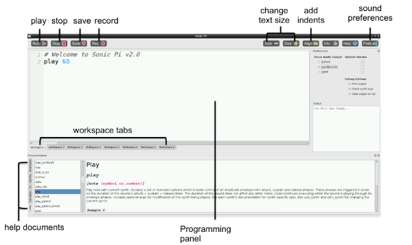

# Getting started with Sonic Pi

Ever wanted to make funky music like Daft Punk or will.i.am but you're not sure how to hold a cello, let alone play it? Sonic Pi could get you there.

Open Sonic Pi from the Desktop or applications menu:


## First sounds with Sonic Pi



This is the Sonic Pi interface; it has three main windows. The largest one is for writing your code, and we call it the Programming Panel. There is also an output panel that displays information about your program as it runs. When you click on the **help** button at the top of the window, the third panel appears along the bottom displaying help documentation. This contains information about different code you can try and use, as well as different synth sounds, samples, and much more.

1. Launch Sonic Pi from the desktop or applications menu.

1. Select **Workspace 1** and type:

	```ruby
	play 60
	```

1. Click on the **play** icon at the top of the screen. What happens?

1. What happens if you type `pley 60` and click on the play icon?

	This is an example of a bug in your code. In later activities, if the error panel displays text you will know that you have a bug that you need to fix. It could be that you have misspelt a word like `play`.

1. Now type:

	```ruby
	play 60
	play 67
	play 69
	```

1. Click on the play icon at the top of the screen. What happens?

1. The computer is playing each note in sequence (one after the other), but it is happening so fast that to us they sound like they are playing at the same time.

	We need to tell the computer to pause between each note. We can do this by typing the following after each `play`:

	```ruby
	sleep 1
	```
	The value entered after the word `sleep` represents time in seconds. Using the value 1 represents one second. What would you type for half a second?

1. Now write a sequence of play and sleep to make a cool-sounding tune!

## Step 2: Loop a tune

Now you have mastered the basics of Sonic Pi, let's code a tune!

1. Select Workspace 2.

2. Type the following code:

    ```ruby
    play 60
    sleep 0.5
    play 62
    sleep 0.5
    play 64
    sleep 0.5
    play 60
    sleep 0.5
    ```

3. Now click on the play icon at the top of the screen and it will play the first part of a tune. Can you tell what it is?

	*Answer: Frère Jacques!*.

    This first section plays twice. How could you repeat it? You could type the same section out again, or we could start to introduce loops to your code.

4. At the top of your code, above the first `play 60`, type:

    ```ruby
    2.times do
    ```

5. And at the bottom of your code, below `sleep 0.5`, type:

    ```ruby
    end
    ```

6. Click on the play icon at the top of the screen. What happens?

    Let's play this part in Sonic Pi.

    In the example below, you can see that some lines of code are indented. This makes it easier to read your code, and check for any bugs if it does not work when you press the play button. You can press the space bar twice to indent a line of code.

    ```ruby
    2.times do
      play 60
      sleep 0.5
      play 62
      sleep 0.5
      play 64
      sleep 0.5
      play 60
      sleep 0.5
    end
    ```
### Loop forever?

Looping notes for a set number of times is certainly useful, but what if you want to loop your tune forever?

Instead of using `2.times do` and `end` you can use `loop do` and `end`, like this:

```ruby
loop do
  play 60
  sleep 0.5
end
```

## Step 3: MIDI notes and music notes

The values that you have been typing after the word `play` represent notes; in fact, they are MIDI note numbers. This means we can translate songs played on a piano into Sonic Pi using a table like so:

`C D E C` or `60 62 64 60` in MIDI notes.

**Music Notes to MIDI Note Values**

| C       | D      | E     | F     | G     | A     | B     |
| :-----: |:------:|:-----:|:-----:|:-----:|:-----:|:-----:|
| 60      | 62     | 64    | 65    | 67    | 69    | 71    |

This is quite a long process if you know the notes of the song you are trying to play. With Sonic Pi you are able to use standard sheet music notation too.

### Activity checklist:

1. In a new workspace tab type:

	```ruby
	play :c4
	sleep 0.5
	play :d4
	sleep 0.5
	play :e4
	sleep 0.5
	play :c4
	sleep 0.5
	```
1. Press **play** to hear your tune. Does it sound the same as when you used MIDI notes?

## Step 4: Change the sounds

It's time to make your tune sound more interesting! We can do this by changing the synthesizer sounds it is using. The default Sonic Pi synth is called `beep`.

To use a different synth, you need to add the code `use_synth :name of synth` above the sequence of code you want to use it in.

In this example, `fm` is the name of the synth:

```ruby
use_synth :fm
2.times do
  play 60
  sleep 0.5
  play 67
  sleep 0.5
end
```

### Synths to try

There are lots of cool-sounding synths included with Sonic Pi. To find the names of them, click on the **help** icon at the top of the screen so that the help documents window appears. Then select **Synths** from the tabs along the left hand side of the help window. Click on any of the synth names to get more information on how to use it.

## Step 5: Use samples

Not only can you create music in Sonic Pi using single notes, you can also create music with samples. Samples are pre-recorded sounds or tunes that you can bring into your music. This is a really simple way to make your music sound amazing!

To use a sample, you need to add the code `sample :name of sample` in the sequence of your music program where you want it to play.

In this example, `loop_amen` is the name of the sample:

```ruby
2.times do
  sample :loop_amen
  sleep 1.753
end
```

### Samples to try

There are lots of samples included with Sonic Pi. To find the names of them, click on **help** followed by **samples** on the left hand side of the help window. Click on any of the sample names to get more information on how to use it.

## Step 6: Playing two tunes at the same time

Music often has a repeating backing track, with a separate melody played over the top. So far in Sonic Pi you have played one tune. Let's try playing two tunes at the same time!

### Activity checklist:

1. Click on a new workspace tab.

2. The code we use to play two tunes at the same time needs to be between `in_thread do` and `end`.

3. Underneath `in_thread do`, type your tune. Here I've used a sample for my backing track:

    ```ruby
    in_thread do
      loop do
        sample :loop_amen
        sleep 1.753
      end
    end
    ```

    This first 'thread' will act as the melody of your music. Underneath, you can type the code for your backing track or baseline.

4. Type:

    ```ruby
    in_thread do
      16.times do
        play 75
        sleep 1.753
        play 74
        sleep 0.25
      end
    end
    ```
5. Now press **play** and you should hear both threads playing at the same time.

## Step 7: Live code!

Sonic Pi has been developed to be a platform for the live coding of music, so that the code can be manipulated, changed and adapted in real time; this means coders can perform their code rather than playing pre-written programs. Why not have a go?

1. In a new workspace tab type:

	```ruby
	define :play_my_synth do
	  use_synth :prophet
  	  play 50, attack: 0.2, release: 1.3
      sleep 0.5
    end

    loop do
      play_my_synth
    end
    ```

1. Press **play** to start the program.

1. While the tune is playing, comment out the last three lines by adding a `#` symbol to the start of each line like this:

	```ruby
	# loop do
	#   play_my_synth
	# end
	```

1. Next change some of code in the function, and press **play** again. Now you are really rocking!
