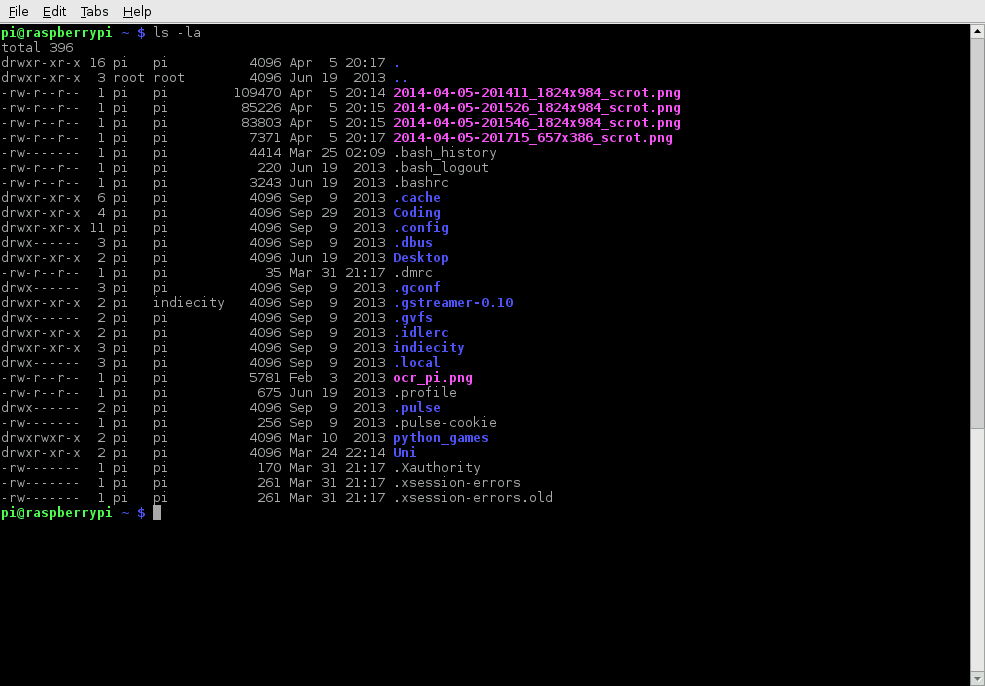

# Terminal

The terminal (or 'command-line') on a computer allows a user a great deal of control over their system (or in this case, Pi!). Users of Windows may already have come across `Command Prompt` or `Powershell` and Mac OS users may be familiar with `Terminal`. All of these tools allow a user to directly manipulate their system through the use of commands. These commands can be chained together and/or combined together into complex scripts that can be potentially more efficient at completing tasks than much larger traditional software packages.

## Starting LXTerminal

On the Raspberry Pi (running Raspbian), the default terminal application is `LXTerminal`. This is known as a 'terminal emulator', this means that it emulates the old style video terminals (from before graphical user interfaces were developed) in a graphical environment. The application can be found on the Raspberry Pi desktop and when started will look something like this:


You should be able to see a line saying something similar to:

`pi@raspberrypi ~ $`

However this may vary for you, in this example `pi` is the name of the currently logged in user and `raspberrypi` is the 'hostname' of the Pi (so if your user name was Fred and the hostname was `fredsraspberry` then it would be `fred@fredsraspberry`).

Now, let's try running a command. Type `pwd` followed by the `enter` key. This should display something along the lines of `\home\pi` (again this depends on your user name!). This command is displays your 'present working directory' (hence `pwd`!).

## Navigating and browsing your Pi

One of the key aspects of using a terminal is being able to navigate your file system. Firstly, run the following command: `ls -la`. You should see something similar to:



The `ls` command lists the contents of the directory that you are currently in (your present working directory). The `-la` component of the command is what's known as a 'flag', these modify the command that's being run. In this case the `l` displays the contents of the directory in a list, showing data such as their sizes and when they were last edited, and the `a` displays all files, including those beginning with a . - known as 'dotfiles'. Dotfiles usually act as configuration files for software and as they are written in text, they can be modified by simply editing them. 

In order to navigate to other directories the change directory command, `cd`, can be used. You can specify the directory that you want to go to by either the 'absolute' or the 'relative' path. So if you wanted to navigate to the `python_games` directory, you could either do `cd /home/pi/python_games` or just `cd python_games` (if you are currently in `/home/pi`). There are some special cases that may be useful: by putting `~` before a path it will act as an alias for your home directory, so `~/python_games` is the same as `/home/pi/python_games`; each directory contains two subdirectories, `.` and `..`, these are aliases for the current directory and the parent directory respectively.

## History and auto-complete

Rather than type every command, the terminal allows you to scroll through previous commands that you've run by pressing the `up` or `down` keys on your keyboard. If you are writing the name of a file or directory as part of a command then pressing `tab` will attempt to auto-complete the name of what you are typing. If you have a file in a directory called `aLongFileName` then pressing tab after typing `a` will allow you to choose from all file and directory names beginning with `a` in the current directory, allowing you to choose `aLongFileName`.

## Shell scripts

Commands can be combined together into a file which can then be executed. As a (silly) example, copy the following into your favourite text editor:

```bash
while 1
do
echo Raspberry Pi!
done
```
Now, save this with the name `fun-script`. Before you can run it you must first make it executable, this can be done by using the change mode command `chmod`. Each file and directory has it's own set of permissions that dictate what a user can and can't do to it. In this case, by running the command `chmod +x fun-script`, the file `fun-script` will now be executable. You can then run it by typing `./fun-script`. This script infinitely loops and prints `Raspberry Pi!`, in order to stop it press `ctrl-C`, this kills any command that's currently being run in the terminal.

## Sudo

Some commands that make permanent changes to the state of your system require you to have root privileges to run. The command `sudo` temporarily gives your account (if you're not already logged in as root) the ability to run these commands, provided your user name is in a list of users ('sudoers'). When you append `sudo` to the start of a command and press `enter` you will be asked for your password, if that is entered correctly then the command you want to run will be run using root privileges. Be careful though, some commands that require `sudo` to run can irreparably damage your system so be careful!

## Installing software through apt-get

Rather than using the Pi Store to download new software you can use the command `apt-get`, this is the 'package manager' that is included with any Debian based Linux distributions (including Raspbian). It allows you to install and manage new software packages on your Pi. In order to install a new package you would type `sudo apt-get install <package-name>` (where `<pacakge-name>` is the package that you want to install). Running `sudo apt-get update` updates a list of software packages that are available on your system. If a new version of a package is available then `sudo apt-get upgrade` will update any old packages to the new version. Finally, `sudo apt-get remove <pacakge-name>` removes or uninstalls a package from your system.

## Other useful commands

There are a few other commands that you may find useful, these are listed below:

* `cp`: This makes a copy of a file and places it at the specified location (essentially doing a 'copy-paste'), for example - `cp ~/fileA /home/otherUser/` would copy the file `fileA` from your home directory to that of the user `otherUser` (assuming you have permission to copy it there!).
* `mv`: This moves a file and places it at the specified location (so where `cp` performs a 'copy-paste', `mv` performs a 'cut-paste'). The usage is similar to `cp`, so `mv ~/fileA /home/otherUser/` would move the file `fileA` from your home directory to that of the user otherUser.
* `rm`: This will remove the specified file (or directory when used with `-r`). Be careful with this! Files deleted in this way are mostly gone for good!
* `mkdir`: This makes a new directory, e.g. `mkdir newDir` would create the directory `newDir` in the present working directory.
* `rmdir`: The will remove an empty directory, e.g. `mkdir oldDir` will remove the directory `oldDir` only if it is empty.
* `cat`: Lists the contents of file(s), e.g. `cat thisFile` will display the contents of `thisFile`.

## Finding out about a command

If you want to find out more information about a particular command then by running the command `man` followed by the command you want to know more about (e.g. `man ls`), the man-page (or manual page) will be displayed including information about the flags that can be used with that program and what effect they have. Some man-pages will give examples of usage or even list current bugs!
