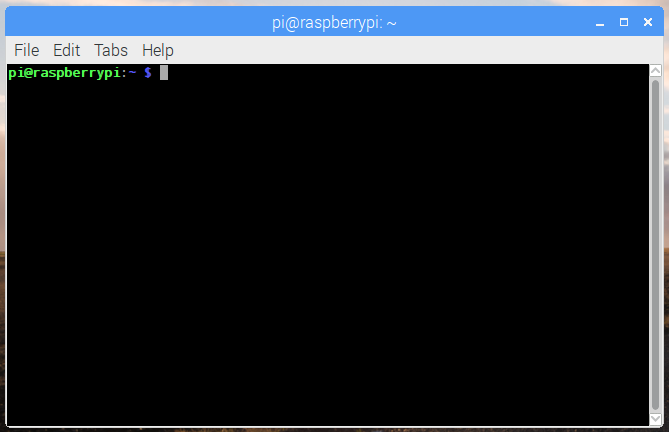
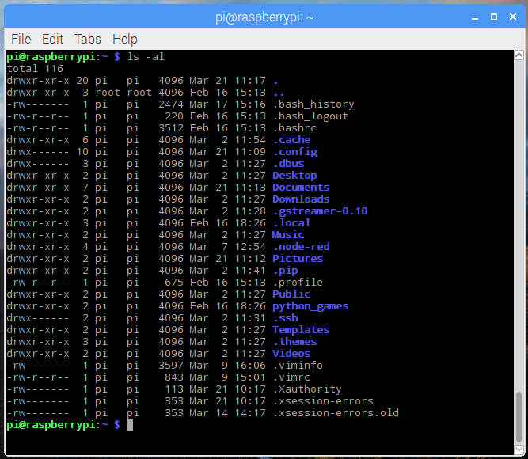

# Terminal

The terminal (or 'command-line') on a computer allows a user a great deal of control over their system (or in this case, Pi!). Users of Windows may already have come across `Command Prompt` or `Powershell` and Mac OS users may be familiar with `Terminal`. All of these tools allow a user to directly manipulate their system through the use of commands. These commands can be chained together and/or combined together into complex scripts (see the [linux usage page on scripting](../../linux/usage/scripting.md)) that can potentially complete tasks more efficiently than much larger traditional software packages.

## Opening a Terminal window

On the Raspberry Pi (running Raspberry Pi OS), the default terminal application is `LXTerminal`. This is known as a 'terminal emulator', this means that it emulates the old style video terminals (from before graphical user interfaces were developed) in a graphical environment. The application can be found on the Raspberry Pi desktop and when started will look something like this:



You should be able to see the following prompt:

```bash
pi@raspberrypi ~ $
```

This shows your username and the hostname of the Pi. Here the username is `pi` and the hostname is `raspberrypi`.

Now, let's try running a command. Type `pwd` (present working directory) followed by the `Enter` key. This should display something like `/home/pi`.

## Navigating and browsing your Pi

One of the key aspects of using a terminal is being able to navigate your file system. Firstly, run the following command: `ls -la`. You should see something similar to:



The `ls` command lists the contents of the directory that you are currently in (your present working directory). The `-la` component of the command is what's known as a 'flag'. Flags modify the command that's being run. In this case the `l` displays the contents of the directory in a list, showing data such as their sizes and when they were last edited, and the `a` displays all files, including those beginning with a `.`, known as 'dotfiles'. Dotfiles usually act as configuration files for software and as they are written in text, they can be modified by simply editing them.

In order to navigate to other directories the change directory command, `cd`, can be used. You can specify the directory that you want to go to by either the 'absolute' or the 'relative' path. So if you wanted to navigate to the `python_games` directory, you could either do `cd /home/pi/python_games` or just `cd python_games` (if you are currently in `/home/pi`). There are some special cases that may be useful: `~` acts as an alias for your home directory, so `~/python_games` is the same as `/home/pi/python_games`; `.` and `..` are aliases for the current directory and the parent directory respectively, e.g. if you were in `/home/pi/python_games`, `cd ..` would take you to `/home/pi`.

## History and auto-complete

Rather than type every command, the terminal allows you to scroll through previous commands that you've run by pressing the `up` or `down` keys on your keyboard. If you are writing the name of a file or directory as part of a command then pressing `tab` will attempt to auto-complete the name of what you are typing. For example, if you have a file in a directory called `aLongFileName` then pressing tab after typing `a` will allow you to choose from all file and directory names beginning with `a` in the current directory, allowing you to choose `aLongFileName`.

## Sudo

Some commands that make permanent changes to the state of your system require you to have root privileges to run. The command `sudo` temporarily gives your account (if you're not already logged in as root) the ability to run these commands, provided your user name is in a list of users ('sudoers'). When you append `sudo` to the start of a command and press `enter`, the command following `sudo` will be run using root privileges. Be very careful: commands requiring root privileges can irreparably damage your system! Note that on some systems you will be prompted to enter your password when you run a command with `sudo`.

Further information on `sudo` and the root user can be found on the [linux root page](../../linux/usage/root.md).

## Installing software using apt

You can use the `apt` command to install software in Raspberry Pi OS. This is the 'package manager' that is included with any Debian-based Linux distributions (including Raspberry Pi OS). It allows you to install and manage new software packages on your Pi. In order to install a new package, you would type `sudo apt install <package-name>` (where `<package-name>` is the package that you want to install). Running `sudo apt update` will update a list of software packages that are available on your system. If a new version of a package is available, then `sudo apt full-upgrade` will update any old packages to the new version. Finally, `sudo apt remove <package-name>` removes or uninstalls a package from your system.

More information about this can be found in the [Linux usage section on apt](../../linux/software/apt.md).

## Other useful commands

There are a few other commands that you may find useful, these are listed below:

- `cp` makes a copy of a file and places it at the specified location (essentially doing a 'copy-paste'), for example - `cp file_a /home/other_user/` would copy the file `file_a` from your home directory to that of the user `other_user` (assuming you have permission to copy it there). Note that if the target is a folder, the filename will remain the same, but if the target is a filename, it will give the file the new name.
- `mv` moves a file and places it at the specified location (so where `cp` performs a 'copy-paste', `mv` performs a 'cut-paste'). The usage is similar to `cp`, so `mv file_a /home/other_user/` would move the file `file_a` from your home directory to that of the specified user. `mv` is also used to rename a file, i.e. move it to a new location, e.g. `mv hello.txt story.txt`.
- `rm` removes the specified file (or directory when used with `-r`). **Warning:** Files deleted in this way are generally not restorable.
- `mkdir`: This makes a new directory, e.g. `mkdir new_dir` would create the directory `new_dir` in the present working directory.
- `cat` lists the contents of files, e.g. `cat some_file` will display the contents of `some_file`.

Other commands you may find useful can be found in the [commands page](../../linux/usage/commands.md).

## Finding out about a command

To find out more information about a particular command then you can run the `man` followed by the command you want to know more about (e.g. `man ls`). The man-page (or manual page) for that command will be displayed, including information about the flags for that program and what effect they have. Some man-pages will give example usage.
