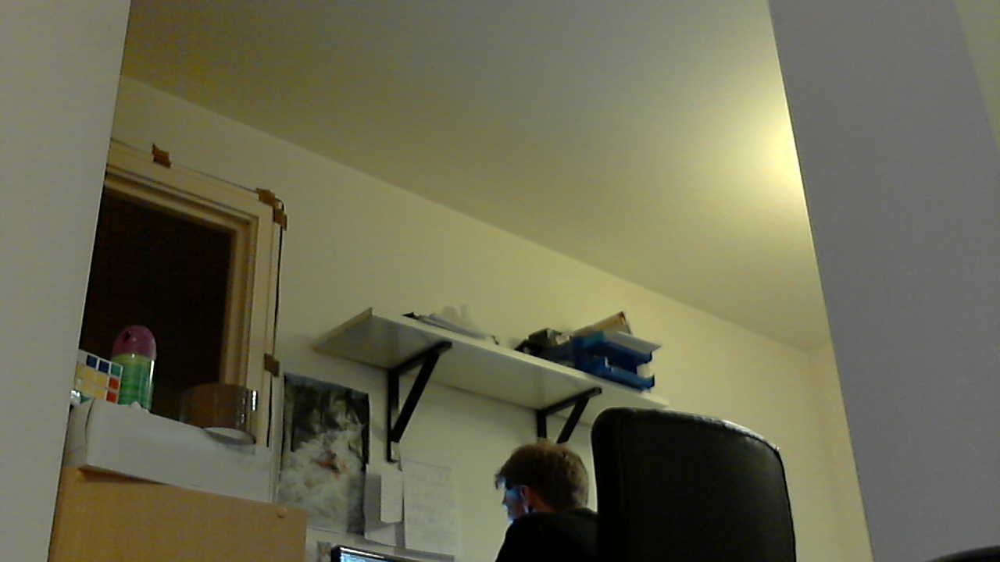

# Using a standard USB webcam

Rather than using the Raspberry Pi [camera module](camera/README.md), you can use a standard USB webcam to take pictures and video on the Raspberry Pi.

Note that the quality and configurability of the camera module is highly superior to a standard USB webcam.

## Install fswebcam

First, install the `fswebcam` package:

```
sudo apt-get install fswebcam
```

## Basic usage

Enter the command `fswebcam` followed by a filename and a picture will be taken using the webcam, and saved to the filename specified:

```
fswebcam image.jpg
```

This command will show the following information:

```
--- Opening /dev/video0...
Trying source module v4l2...
/dev/video0 opened.
No input was specified, using the first.
Adjusting resolution from 384x288 to 352x288.
--- Capturing frame...
Corrupt JPEG data: 2 extraneous bytes before marker 0xd4
Captured frame in 0.00 seconds.
--- Processing captured image...
Writing JPEG image to 'image.jpg'.
```


Note the small default resolution used, and the presence of a banner showing the timestamp.

### Specify resolution

The webcam used in this example has a resolution of `1280 x 720` so to specify the resolution I want the image to be taken at, use the `-r` flag:

```
fswebcam -r 1280x720 image2.jpg
```

This command will show the following information:

```
--- Opening /dev/video0...
Trying source module v4l2...
/dev/video0 opened.
No input was specified, using the first.
--- Capturing frame...
Corrupt JPEG data: 1 extraneous bytes before marker 0xd5
Captured frame in 0.00 seconds.
--- Processing captured image...
Writing JPEG image to 'image2.jpg'.
```


Picture not taken at the full resolution of the webcam, with the banner present.

### Specify no banner

Now add the `--no-banner` flag:

```
fswebcam -r 1280x720 --no-banner image3.jpg
```

which shows the following information:

```
--- Opening /dev/video0...
Trying source module v4l2...
/dev/video0 opened.
No input was specified, using the first.
--- Capturing frame...
Corrupt JPEG data: 2 extraneous bytes before marker 0xd6
Captured frame in 0.00 seconds.
--- Processing captured image...
Disabling banner.
Writing JPEG image to 'image3.jpg'.
```



Now the picture is taken at full resolution with no banner.

## Bash script

You can write a Bash script which takes a picture with the webcam. To create a script, open up your editor of choice and write the following example code:

```
#!/bin/bash

DATE=$(date +"%Y-%m-%d_%H%M")

fswebcam -r 1280x720 --no-banner /home/pi/webcam/$DATE.jpg
```

This script will take a picture and name the file with a timestamp. Say we saved it as `webcam.sh`, we would first make the file executable:

```
chmod +x webcam.sh
```

Then run with:

```
./webcam.sh
```

Which would run the commands in the file and give the usual output:

```
--- Opening /dev/video0...
Trying source module v4l2...
/dev/video0 opened.
No input was specified, using the first.
--- Capturing frame...
Corrupt JPEG data: 2 extraneous bytes before marker 0xd6
Captured frame in 0.00 seconds.
--- Processing captured image...
Disabling banner.
Writing JPEG image to '/home/pi/webcam/2013-06-07_2338.jpg'.
```

## Time-lapse using cron

You can use `cron` to schedule taking a picture at a given interval, such as every minute to capture a time-lapse.

First open the cron table for editing:

```
crontab -e
```

This will either ask which editor you would like to use, or open in your default editor. Once you have the file open in an editor, add the following line to schedule taking a picture every minute (referring to the Bash script from above):

```
* * * * * /home/pi/webcam.sh 2>&1
```

Save and exit and you should see the message:

```
crontab: installing new crontab
```

Ensure your scipt does not save each picture taken with the same filename. This will overwrite the picture each time.

## Other Useful tools

Other tools are available that may come in handy when using the camera or a webcam:

- [SSH](../remote-access/ssh/README.md)
    - Use SSH to remotely access the Raspberry Pi over your local network
- [SCP](../remote-access/ssh/scp.md)
    - Copy files over SSH to get copies of pictures taken on the Pi on your main computer
- [rsync](../remote-access/ssh/rsync.md)
    - Use `rsync` to syncronise the folder of pictures taken in a folder between your Pi to your computer
- [cron](../linux/cron.md)
